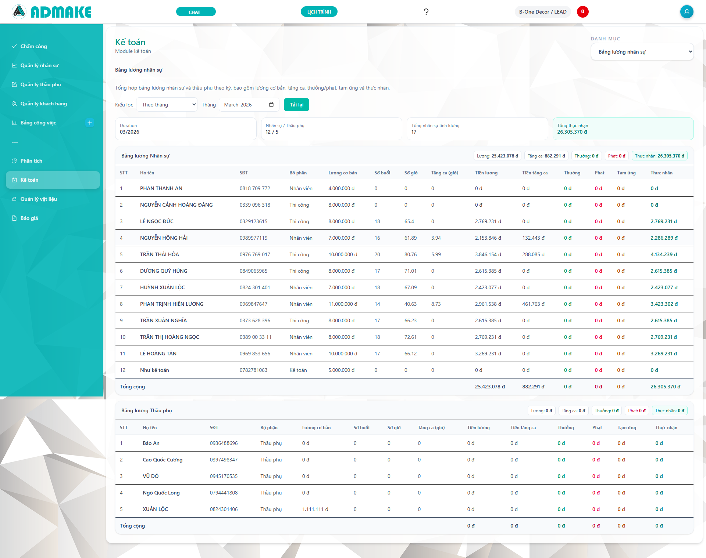
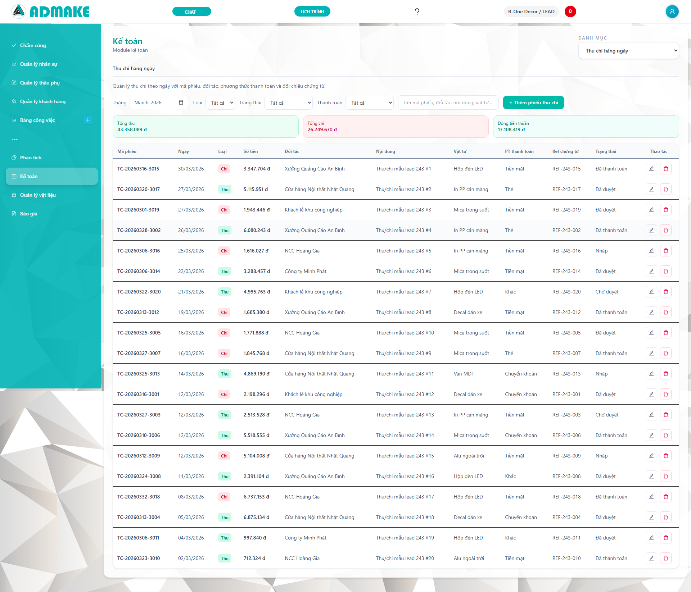
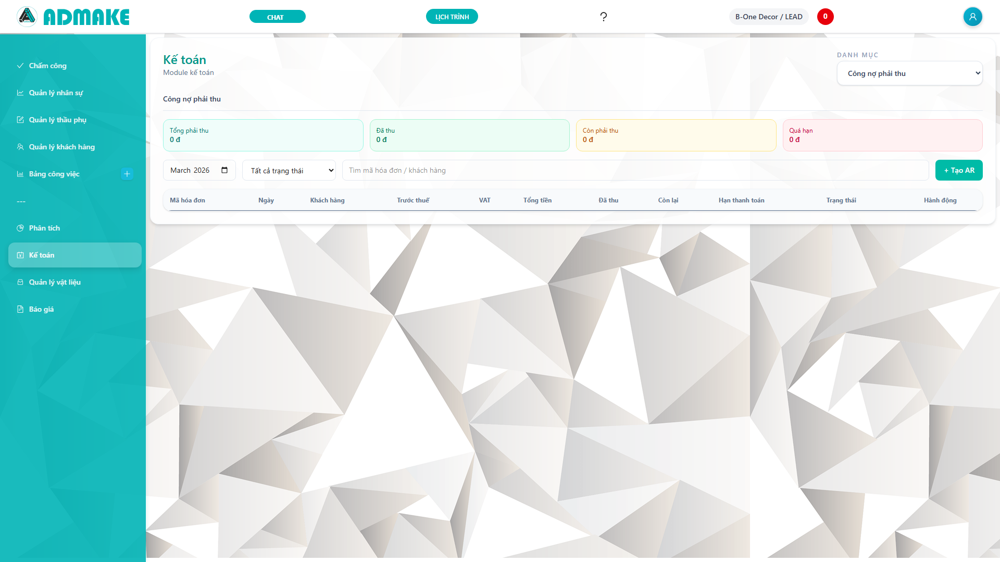
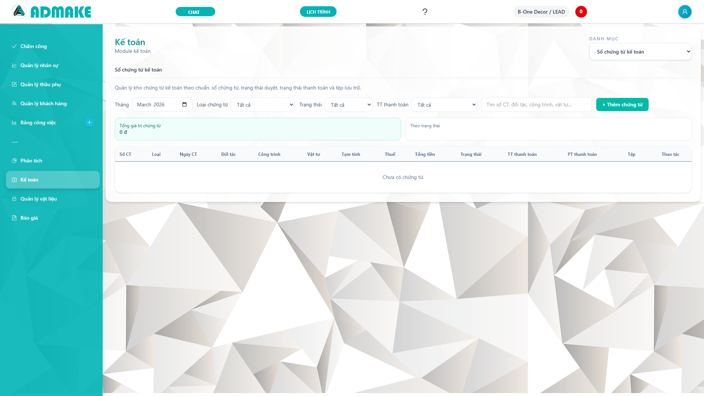
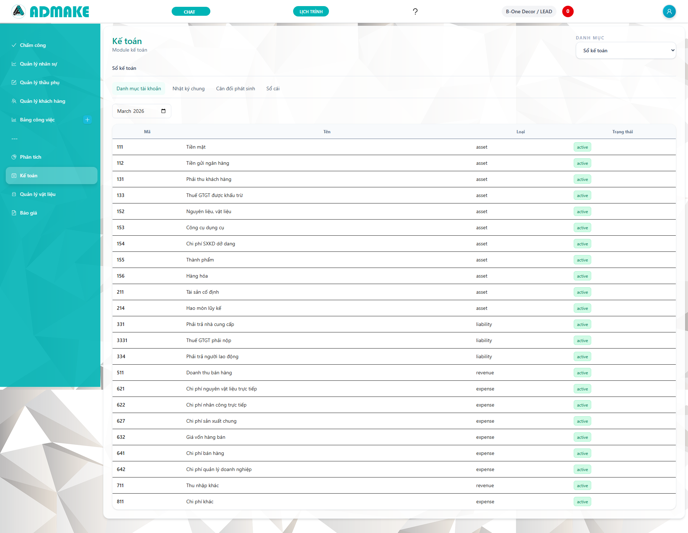
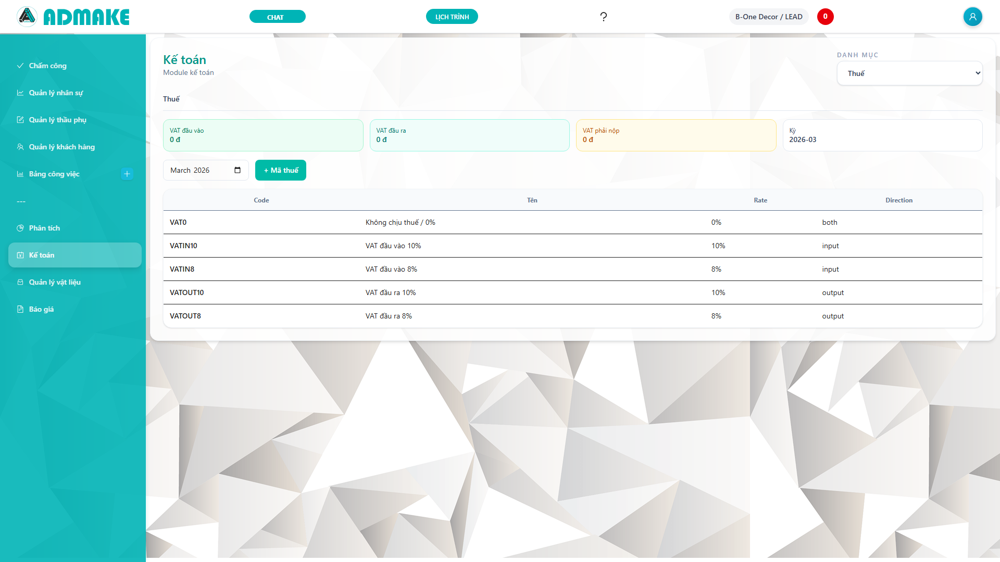
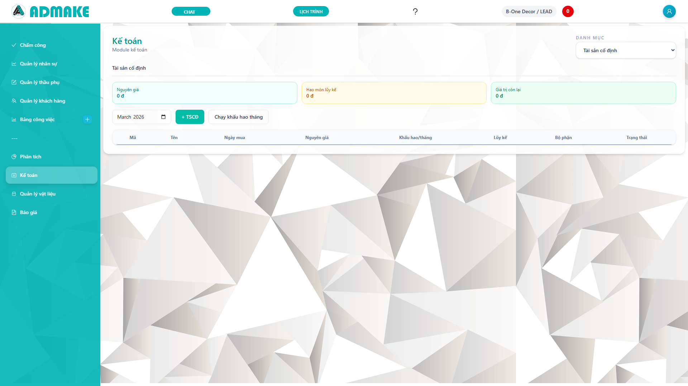
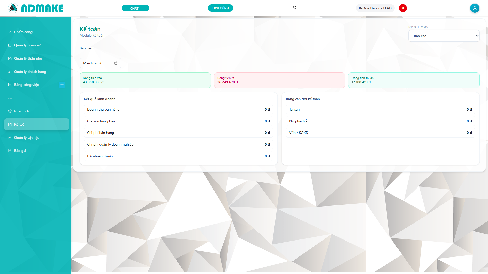
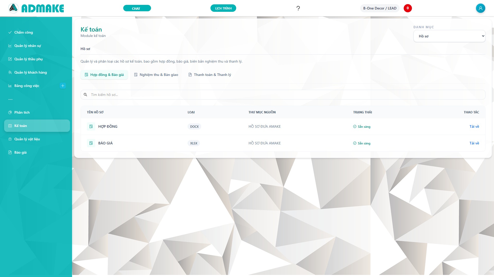
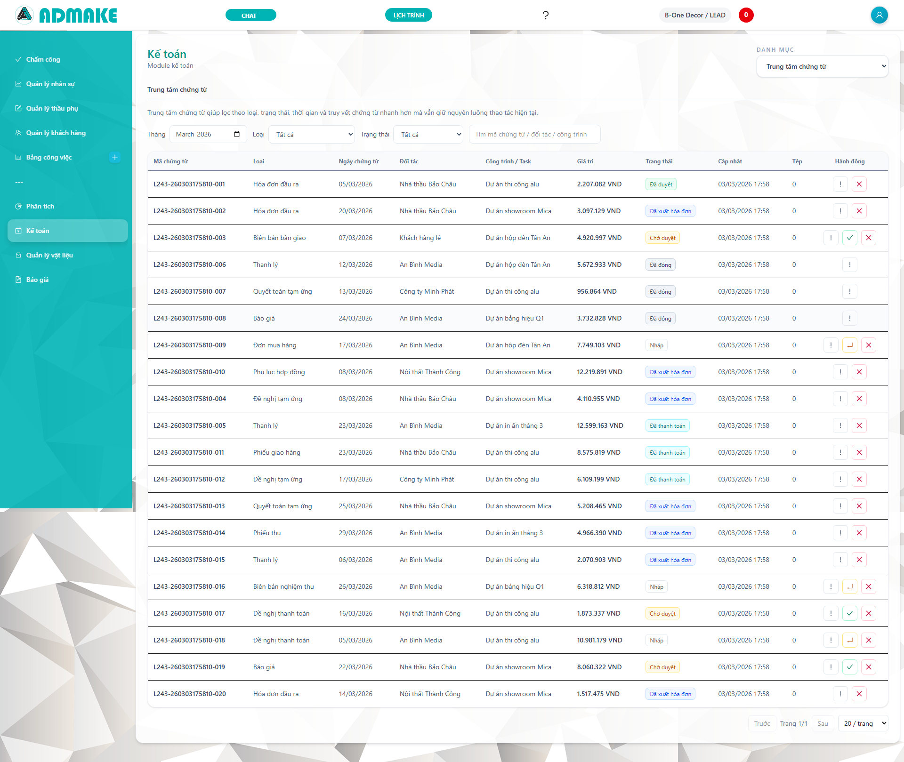

# CẨM NANG VẬN HÀNH MODULE KẾ TOÁN

> Nếu đang quay lại repo để bảo trì code hoặc kiểm tra production, đọc thêm `guidance/returning_guide.md` và `HELP_ACCOUNT_&_MTL.md` trước. File này thiên về hướng dẫn nghiệp vụ cho người dùng vận hành.

Tài liệu này là hướng dẫn nội bộ dành cho nhân sự kế toán, điều hành, thủ quỹ, nhân sự và bộ phận hồ sơ của Admake. Mục tiêu là giúp người dùng hiểu đúng chức năng từng màn hình, biết cách thao tác, kiểm soát dữ liệu đầu vào và xử lý các tình huống thường gặp trong quá trình vận hành hằng ngày.

Phạm vi tài liệu gồm: bảng lương, thu chi, công nợ phải thu, công nợ phải trả, chứng từ kế toán, sổ kế toán, thuế, tài sản cố định, báo cáo, hồ sơ và trung tâm chứng từ. Tài liệu cũng mô tả các luồng phối hợp giữa chứng từ gốc, công nợ, dòng tiền và bút toán để người dùng có thể tra soát nhanh khi số liệu lệch.

- Tuyến truy cập chính: `/accounting`
- Khuyến nghị sử dụng: Chrome hoặc Edge, độ phân giải từ 1920x1080
- Nguyên tắc vận hành: nhập đúng kỳ, đúng đối tượng, đúng số tiền, hạn chế sửa tay dữ liệu đã xác nhận
- Nhóm người dùng phù hợp: kế toán nội bộ, thủ quỹ, HR phụ trách lương, quản lý hồ sơ, quản lý doanh nghiệp

---

## 1. Cách đọc tài liệu và nguyên tắc sử dụng hệ thống

Đây không chỉ là tài liệu giới thiệu màn hình mà là tài liệu vận hành. Khi sử dụng, nên đọc theo thứ tự từ phần tổng quan tới từng phân hệ để hiểu dữ liệu chảy như thế nào. Với người mới nhận việc, nên đọc ba phần đầu tiên trước: tổng quan hệ thống, thu chi, công nợ. Với người làm nghiệp vụ sâu hơn, cần đọc tiếp phần sổ kế toán, thuế, tài sản cố định và báo cáo.

Trong module kế toán, nhiều màn hình không hoạt động tách biệt mà phụ thuộc nhau. Ví dụ: tạo hóa đơn phải thu sẽ làm tăng công nợ khách hàng; khi thu tiền từ khách, phiếu thu sẽ cập nhật số đã thu và có thể sinh bút toán; khi kiểm tra báo cáo cuối kỳ, kế toán cần quay lại nhật ký chứng từ hoặc công nợ để tìm nguyên nhân chênh lệch. Vì vậy, người dùng phải luôn xác định mình đang xử lý “gốc dữ liệu” hay đang xem “dữ liệu tổng hợp”.

Nguyên tắc sử dụng:
- Không nhập trùng một nghiệp vụ ở hai màn hình khác nhau.
- Không dùng phiếu thu chi để thay thế cho hóa đơn công nợ nếu nghiệp vụ thực chất là bán hàng hoặc mua hàng có theo dõi phải thu/phải trả.
- Không sửa dữ liệu đã xác nhận nếu hệ thống đang yêu cầu hủy, đảo hoặc tạo bút toán điều chỉnh.
- Khi có sai lệch, luôn dò từ chứng từ gốc rồi mới sang phiếu tiền và sổ cái.
- Các số tổng trên summary card chỉ có ý nghĩa khi bộ lọc thời gian và trạng thái đang đúng.

Checklist đầu ngày cho người vận hành:
- Kiểm tra mình đang đứng ở đúng tháng, đúng kỳ.
- Kiểm tra bộ lọc trạng thái có đang để “Tất cả” hay không.
- Kiểm tra kết nối với chứng từ và công nợ nếu đang làm thao tác thanh toán.
- Kiểm tra đối tượng khách hàng, nhà cung cấp, nhân viên đã chọn đúng chưa.

Checklist cuối ngày:
- Đối chiếu số phiếu thu chi mới phát sinh.
- Xem hóa đơn nào đã thu hoặc trả nhưng chưa cập nhật đủ trạng thái.
- Kiểm tra các chứng từ đang nằm ở trạng thái nháp nhưng lẽ ra phải xác nhận.
- Kiểm tra các báo cáo tổng hợp có biến động bất thường so với hôm trước.

---

## 2. Tổng quan kiến trúc dữ liệu kế toán

Module kế toán của hệ thống được thiết kế theo hướng thực dụng: dữ liệu gốc phát sinh ở bảng lương, thu chi, công nợ, chứng từ và tài sản cố định; dữ liệu kế toán tổng hợp được phản ánh ở bút toán và báo cáo. Người dùng không cần nhớ chi tiết kỹ thuật, nhưng cần hiểu quan hệ tối thiểu giữa các nhóm dữ liệu sau:

- Chứng từ: là dữ liệu gốc hoặc hồ sơ làm căn cứ nghiệp vụ.
- Công nợ AR/AP: là số phải thu hoặc phải trả theo đối tượng.
- Phiếu thu/phiếu chi: là dòng tiền thực nhận hoặc thực trả.
- Bút toán: là lớp kế toán tổng hợp, phục vụ sổ cái và báo cáo.
- Báo cáo: là phần tổng hợp cuối kỳ.

Một nghiệp vụ chuẩn thường đi theo chuỗi:
- Bán hàng hoặc cung cấp dịch vụ -> tạo AR -> thu tiền một phần hoặc toàn bộ -> phiếu thu -> bút toán.
- Mua hàng hoặc chi phí có hóa đơn -> tạo AP -> thanh toán -> phiếu chi -> bút toán.
- Chốt lương -> tạo khoản phải trả lương hoặc bút toán 334 -> chi lương -> phiếu chi lương.
- Ghi tăng tài sản -> quản lý tài sản -> khấu hao theo tháng -> bút toán hao mòn.

Các dấu hiệu dữ liệu đang lệch:
- Hóa đơn đã thu đủ nhưng trạng thái vẫn còn phải thu.
- Phiếu chi đã phát sinh nhưng công nợ nhà cung cấp không giảm.
- Báo cáo tổng hợp có số nhưng không truy ngược được chứng từ.
- Sổ cái có bút toán nhưng chứng từ gốc không rõ nguồn.
- Thuế đầu vào hoặc đầu ra không khớp tổng hóa đơn trong kỳ.

Khi gặp lệch số, thứ tự truy vết nên là:
1. Kiểm tra bộ lọc thời gian và trạng thái.
2. Kiểm tra chứng từ gốc đã xác nhận chưa.
3. Kiểm tra payment history đã ghi đúng đối tượng và số tiền chưa.
4. Kiểm tra journal entry có được sinh ra và ở trạng thái posted hay không.
5. Kiểm tra báo cáo đang đọc số từ kỳ nào.

---

## 3. Bảng lương nhân sự

Bảng lương là nơi tập trung dữ liệu lương phải trả theo kỳ cho từng nhân sự hoặc từng bộ phận. Đây là màn hình HR và kế toán sử dụng chung để kiểm tra số liệu lương trước khi chi trả. Người dùng không nên xem đây chỉ là bảng hiển thị; nó là bước trung gian giữa dữ liệu chấm công, điều chỉnh lương và nghĩa vụ phải trả cho người lao động.

- Route thao tác: `/accounting` với tab `Bảng lương nhân sự`
- Mục đích: kiểm tra lương phải trả, số đã chi, số còn phải trả
- Ảnh minh họa: `screenshots/payroll.png`

Thông tin cần chú ý trên màn hình:
- Kỳ lương hoặc tháng lương.
- Tổng lương phải trả.
- Phần đã chi và phần còn treo.
- Danh sách nhân sự hoặc batch lương.
- Trạng thái đã chốt hay chưa chốt.

Quy trình thao tác chuẩn:
- Chọn tháng lương cần kiểm tra.
- Rà các khoản lương, phụ cấp, thưởng phạt.
- Đối chiếu với dữ liệu chấm công nếu có chênh lệch.
- Chốt bảng lương khi đã hoàn tất kiểm tra.
- Khi chi lương, dùng luồng thanh toán tương ứng để ghi nhận số đã trả.

Các trường hợp sử dụng thường gặp:
- HR cần kiểm tra tổng quỹ lương tháng trước khi trình duyệt.
- Kế toán cần biết phần lương đã chi và còn phải trả để đối chiếu 334.
- Ban điều hành cần biết chi phí nhân sự theo tháng để so sánh với doanh thu.

Tình huống chuẩn 1: chốt lương cuối tháng
- Điều kiện: dữ liệu chấm công đã hoàn tất, không còn phiếu điều chỉnh lương chờ duyệt.
- Bước 1: mở tab Bảng lương, chọn đúng tháng.
- Bước 2: kiểm tra tổng lương, các khoản thưởng phạt, số lao động có phát sinh.
- Bước 3: chốt lương.
- Kỳ vọng: dữ liệu lương được khóa theo kỳ và sẵn sàng cho bước chi lương hoặc hạch toán 334.

Tình huống chuẩn 2: chi lương nhiều đợt
- Có thể doanh nghiệp chi lương làm 2 đợt: tạm ứng và phần còn lại.
- Khi chi đợt 1, cần ghi đúng số tiền đã chi và đối chiếu về batch lương hoặc nhân sự.
- Sau đợt 1, báo cáo lương phải trả phải còn số dư đúng bằng phần chưa chi.
- Sau đợt 2, khoản phải trả lương cần về 0 hoặc gần 0 theo đúng dữ liệu.

Điểm kiểm soát:
- Không chốt lương khi dữ liệu chấm công còn thay đổi.
- Không dùng phiếu chi tay không gắn ngữ cảnh nếu thực chất là chi lương.
- Kiểm tra tổng số chi lương thực tế có khớp tổng giảm 334 hay không.

Lỗi thường gặp:
- Chốt lương sai tháng.
- Chi lương nhưng không gắn vào batch lương, làm mất khả năng đối chiếu.
- Số đã chi trong tab lương không khớp phiếu chi vì người dùng chọn sai đối tượng.

Checklist kiểm tra nhanh:
- Đúng tháng.
- Đúng tổng lương.
- Đúng trạng thái chốt.
- Đúng số đã chi.
- Đúng số còn phải trả.

---

## 4. Thu chi hàng ngày

Thu chi hàng ngày là màn hình làm việc với dòng tiền thực tế. Người dùng cần phân biệt rõ: đây là nơi ghi nhận tiền đã nhận hoặc đã trả, không phải nơi khai báo nghĩa vụ công nợ nếu nghiệp vụ cần theo dõi AR/AP. Mọi khoản thu chi tiền mặt, ngân hàng, chi lương, trả nhà cung cấp hoặc thu nợ khách hàng đều nên đi qua màn này theo đúng ngữ cảnh.

- Route thao tác: `/accounting` với tab `Thu chi hàng ngày`
- Ảnh minh họa: `screenshots/cashflow.png`

Các nhóm phiếu thường dùng:
- Phiếu thu từ khách hàng.
- Phiếu chi thanh toán nhà cung cấp.
- Phiếu chi nội bộ như văn phòng phẩm, điện nước.
- Phiếu chi lương.
- Phiếu thu hoặc chi điều chỉnh khác.

Các trường quan trọng:
- Ngày chứng từ.
- Loại phiếu thu hoặc chi.
- Quỹ hoặc tài khoản sử dụng.
- Đối tượng.
- Số tiền.
- Nội dung.
- Phương thức thanh toán.
- Tham chiếu chứng từ gốc.
- Trạng thái.

Quy trình chuẩn cho phiếu thu:
- Xác định đây là thu nợ, thu bán hàng trực tiếp hay thu khác.
- Chọn đúng đối tượng nộp tiền.
- Chọn đúng quỹ hoặc tài khoản nhận tiền.
- Nhập số tiền và diễn giải.
- Nếu thu liên quan công nợ, phải liên kết đúng invoice.

Quy trình chuẩn cho phiếu chi:
- Xác định đây là thanh toán AP, chi phí nội bộ hay chi lương.
- Chọn đúng đối tượng nhận tiền.
- Chọn đúng phương thức và tài khoản tiền.
- Kiểm tra số tiền không vượt số dư hoặc không vượt công nợ còn lại nếu có ràng buộc.

Tình huống chuẩn 1: chi tiền mặt mua văn phòng phẩm
- Bước 1: tạo phiếu chi.
- Bước 2: chọn quỹ tiền mặt.
- Bước 3: nhập nội dung “Mua giấy in”, số tiền 500.000.
- Bước 4: lưu.
- Kết quả mong đợi: số dư quỹ giảm, giao dịch xuất hiện trong danh sách, có thể truy ra chi phí tương ứng.

Tình huống chuẩn 2: thu một phần công nợ khách hàng
- Bước 1: mở phiếu thu.
- Bước 2: chọn khách hàng và invoice cần thu.
- Bước 3: nhập số tiền nhận thực tế.
- Bước 4: xác nhận.
- Kết quả mong đợi: AR giảm đúng số tiền, payment history ghi nhận thêm một dòng, bút toán hoặc trace link được sinh.

Tình huống chuẩn 3: trả nhà cung cấp bằng chuyển khoản
- Bước 1: tạo phiếu chi, chọn tài khoản ngân hàng.
- Bước 2: chọn bill AP liên quan.
- Bước 3: nhập số tiền trả.
- Bước 4: kiểm tra số còn phải trả sau thanh toán.

Điểm kiểm soát:
- Phiếu thu chi phải có nội dung rõ nghĩa.
- Không nhập âm số tiền.
- Không tạo phiếu chi trùng cho một bill đã thanh toán xong.
- Kiểm tra trạng thái duyệt hoặc xác nhận trước khi dùng số liệu báo cáo.

Lỗi thường gặp:
- Chọn sai phương thức thanh toán.
- Chọn sai invoice hoặc bill nên công nợ không giảm đúng đối tượng.
- Nhập số tiền vượt công nợ còn lại.
- Phiếu đã tạo nhưng để trạng thái nháp quá lâu.

Checklist cuối ngày cho thủ quỹ hoặc kế toán tiền:
- Phiếu thu chi có đủ đối tượng.
- Không có phiếu số tiền bằng 0.
- Không có phiếu nháp tồn quá hạn.
- Tổng thu chi theo ngày hợp lý so với thực tế.

---

## 5. Công nợ phải thu (Accounts Receivable - AR)

AR là nơi quản lý nghĩa vụ khách hàng phải thanh toán cho doanh nghiệp. Nếu doanh nghiệp cung cấp dịch vụ, thi công, bán hàng hoặc nghiệm thu theo từng đợt, AR là màn hình trọng tâm để theo dõi còn phải thu bao nhiêu, khách nào đang quá hạn, invoice nào đã thu một phần.

- Route thao tác: `/accounting` với tab `Công nợ phải thu`
- Ảnh minh họa: `screenshots/ar.png`

Thông tin nghiệp vụ chính:
- Mã hóa đơn.
- Ngày hóa đơn.
- Khách hàng.
- Số tiền trước thuế.
- VAT.
- Tổng tiền sau thuế.
- Số đã thu.
- Số còn phải thu.
- Hạn thanh toán.
- Trạng thái.

Ý nghĩa trạng thái thường gặp:
- Draft: hóa đơn đang nháp, chưa làm tăng công nợ.
- Confirmed: đã xác nhận, công nợ đã phát sinh.
- Partially Paid: khách đã trả một phần.
- Paid: khách đã thanh toán đủ.
- Overdue: quá hạn nhưng chưa thu đủ.
- Cancelled: đã hủy theo nghiệp vụ.

Quy trình chuẩn tạo AR:
- Chọn khách hàng.
- Nhập nội dung dịch vụ hoặc hóa đơn.
- Kiểm tra trước thuế, VAT, tổng tiền.
- Chọn hạn thanh toán.
- Lưu nháp nếu chưa chắc số liệu.
- Xác nhận khi đã đầy đủ căn cứ.

Quy trình chuẩn thu tiền:
- Mở invoice hoặc danh sách payment history.
- Ghi nhận thanh toán đúng số tiền thực nhận.
- Chọn quỹ hoặc tài khoản ngân hàng nhận tiền.
- Kiểm tra lại số đã thu và còn lại.

Tình huống chuẩn 1: bán dịch vụ và thu 2 đợt
- Bước 1: tạo invoice 50.000.000 cho khách A.
- Bước 2: xác nhận hóa đơn.
- Bước 3: thu đợt 1 là 20.000.000.
- Bước 4: thu đợt 2 là 30.000.000.
- Kết quả: invoice chuyển từ Confirmed -> Partially Paid -> Paid.

Tình huống chuẩn 2: invoice quá hạn
- Bước 1: kiểm tra aging report tại kỳ hiện tại.
- Bước 2: lọc các hóa đơn quá hạn 1-30, 31-60, 61-90, trên 90 ngày.
- Bước 3: đối chiếu với bộ phận kinh doanh hoặc chăm sóc khách hàng.
- Mục tiêu: xác định khoản phải thu nào có rủi ro, khoản nào đang chờ chứng từ.

Tình huống chuẩn 3: khách trả thừa hoặc ghi nhầm
- Nếu thanh toán vượt số còn phải thu, hệ thống nên chặn hoặc yêu cầu xác nhận theo cấu hình.
- Người dùng không nên tự ghi tay số đã thu trong invoice.
- Cần rà lại payment record, hóa đơn gốc và phiếu thu trước khi xử lý.

Điểm kiểm soát:
- Hạn thanh toán phải đúng theo hợp đồng.
- VAT phải tính từ base amount, không nhập tùy tiện.
- Phiếu thu phải liên kết đúng invoice.
- Aging report phải được đọc theo đúng ngày chốt.

Lỗi thường gặp:
- Invoice đã xác nhận nhưng chưa có lịch sử thanh toán.
- Thu tiền nhưng không link invoice làm AR không giảm.
- Invoice đã paid nhưng phiếu thu thực tế thiếu.
- Quá hạn nhưng người dùng không lọc theo kỳ đúng nên không nhìn ra.

Checklist kiểm tra công nợ phải thu:
- Tổng phải thu của kỳ.
- Top khách hàng nợ lớn.
- Invoice quá hạn.
- Invoice thu một phần.
- Payment history bất thường.

---

## 6. Công nợ phải trả (Accounts Payable - AP)

AP là nơi kiểm soát các khoản doanh nghiệp phải thanh toán cho nhà cung cấp, nhà thầu phụ hoặc các bên có hóa đơn đầu vào. Với doanh nghiệp có sản xuất và thi công, đây là màn hình rất quan trọng vì liên quan trực tiếp tới mua vật tư, chi phí thuê ngoài và kế hoạch dòng tiền.

- Route thao tác: `/accounting` với tab `Công nợ phải trả`
- Ảnh minh họa: `screenshots/ap.png`

Các trường dữ liệu trọng tâm:
- Mã bill.
- Ngày bill.
- Nhà cung cấp.
- Số tiền trước thuế.
- VAT đầu vào.
- Tổng tiền.
- Đã trả.
- Còn phải trả.
- Hạn thanh toán.
- Trạng thái.

Quy trình chuẩn tạo AP:
- Chọn đúng nhà cung cấp.
- Nhập hóa đơn mua hoặc bill dịch vụ.
- Kiểm tra tiền trước thuế, VAT, tổng tiền.
- Xác nhận bill khi có căn cứ rõ ràng.

Quy trình chuẩn thanh toán AP:
- Mở bill cần thanh toán.
- Kiểm tra số còn phải trả.
- Tạo phiếu chi hoặc thao tác thanh toán từ trong AP.
- Chọn đúng tài khoản chi.
- Kiểm tra payment history sau khi lưu.

Tình huống chuẩn 1: bill vật tư trả nhiều đợt
- Bước 1: tạo bill 30.000.000.
- Bước 2: xác nhận.
- Bước 3: trả đợt 1 là 10.000.000.
- Bước 4: trả đợt 2 là 20.000.000.
- Kỳ vọng: trạng thái chuyển từ Confirmed -> Partially Paid -> Paid.

Tình huống chuẩn 2: nhà cung cấp yêu cầu đối chiếu
- Mở supplier statement.
- So bill đã xác nhận với payment history.
- Kiểm tra các bill quá hạn chưa thanh toán.
- In hoặc trích xuất dữ liệu để làm biên bản đối chiếu nội bộ.

Tình huống chuẩn 3: nhập bill có VAT đầu vào
- Kiểm tra tiền trước thuế, VAT, tiền sau thuế.
- Đảm bảo bill đi đúng vào báo cáo VAT đầu vào kỳ tương ứng.
- Nếu bill gắn với nhập kho, cần kiểm tra liên kết chứng từ và kho.

Điểm kiểm soát:
- Không xác nhận bill khi chưa có hóa đơn hoặc chứng từ hợp lệ.
- Không thanh toán vượt số còn phải trả.
- Không dùng phiếu chi tay để thay cho payment AP nếu muốn theo dõi công nợ.
- Kiểm tra VAT đầu vào đúng kỳ.

Lỗi thường gặp:
- Bill xác nhận rồi nhưng chưa thấy trong aging report vì chọn sai kỳ.
- Đã chi tiền nhưng AP không giảm do payment không liên kết.
- Thanh toán nhiều lần cho cùng bill vì không kiểm tra lịch sử trước khi chi.

Checklist kiểm tra AP:
- Tổng phải trả.
- Nhà cung cấp quá hạn.
- Số bill thanh toán một phần.
- Các bill lớn đến hạn trong tuần.
- VAT đầu vào chưa kiểm tra.

---

## 7. Sổ chứng từ kế toán

Sổ chứng từ kế toán là nơi tổng hợp các chứng từ phát sinh theo loại, trạng thái và giá trị. Đây là màn hình phù hợp cho kế toán tổng hợp hoặc quản lý cần nhìn toàn cảnh chứng từ trong kỳ mà không phải mở từng phân hệ riêng lẻ.

- Route thao tác: `/accounting` với tab `Sổ chứng từ kế toán`
- Ảnh minh họa: `screenshots/documents.png`

Mục đích sử dụng:
- Theo dõi danh mục chứng từ theo kỳ.
- Kiểm tra trạng thái chứng từ.
- Rà chứng từ còn nháp hoặc chờ duyệt.
- Truy vết ngược sang nghiệp vụ liên quan.

Các cột thường thấy:
- Số chứng từ.
- Loại chứng từ.
- Ngày chứng từ.
- Đối tác.
- Công trình.
- Giá trị.
- Trạng thái.
- Trạng thái thanh toán.
- Phương thức thanh toán.

Tình huống chuẩn 1: rà chứng từ cuối tháng
- Lọc theo tháng hiện tại.
- Sắp xếp theo trạng thái.
- Tìm các chứng từ còn Draft hoặc Submitted nhưng đáng lẽ phải duyệt xong.
- Kiểm tra chứng từ nào đã có giá trị nhưng chưa có trạng thái thanh toán phù hợp.

Tình huống chuẩn 2: truy vết giao dịch bất thường
- Khi thấy báo cáo hoặc công nợ lệch, vào sổ chứng từ tìm theo mã CT hoặc đối tác.
- Xem chi tiết để biết chứng từ này đã link sang công nợ, tiền hay bút toán chưa.

Tình huống chuẩn 3: kiểm tra chứng từ cho audit nội bộ
- Lọc toàn bộ chứng từ giá trị lớn.
- Kiểm tra chứng từ có đủ tệp đính kèm và đủ chuỗi trạng thái.
- Ghi chú chứng từ thiếu thông tin để bổ sung.

Điểm kiểm soát:
- Số chứng từ phải duy nhất theo logic nghiệp vụ.
- Trạng thái chứng từ phải phản ánh đúng tiến độ.
- Chứng từ giá trị lớn phải có liên kết rõ ràng với hồ sơ.

Lỗi thường gặp:
- Chứng từ có giá trị nhưng thiếu đối tác.
- Chứng từ đã duyệt nhưng chưa có link traceability.
- Mã chứng từ khó tìm vì người dùng nhập không nhất quán.

---

## 8. Sổ kế toán

Sổ kế toán là lớp tổng hợp chính thức của kế toán, bao gồm nhật ký chung, sổ cái theo tài khoản và cân đối phát sinh. Đây là nơi dùng để trả lời câu hỏi “nghiệp vụ này đã được hạch toán chưa” và “số dư tài khoản nào đang thay đổi vì đâu”.

- Route thao tác: `/accounting` với tab `Sổ kế toán`
- Ảnh minh họa: `screenshots/ledger.png`

Các thành phần chính:
- Danh mục tài khoản.
- Nhật ký chung.
- Sổ cái theo tài khoản.
- Trial balance hoặc cân đối phát sinh.

Khi nào cần dùng sổ kế toán:
- Cần tra một bút toán cụ thể theo số chứng từ.
- Cần xem biến động của tài khoản 111, 112, 131, 331, 334, 3331, 133.
- Cần đối chiếu tổng hợp trước khi chốt báo cáo.
- Cần kiểm tra bút toán được sinh từ nghiệp vụ nào.

Tình huống chuẩn 1: tra tài khoản 131
- Mở sổ cái tài khoản 131.
- Lọc kỳ cần tra.
- Xem số phát sinh tăng giảm theo invoice và thu tiền.
- Nếu số dư 131 không đúng, truy ngược invoice hoặc payment tương ứng.

Tình huống chuẩn 2: kiểm tra journal bị lệch
- Mở chi tiết journal entry.
- Kiểm tra tổng Nợ và Có.
- Nếu journal ở trạng thái draft hoặc reversed, không dùng nó cho đối chiếu posted.
- Nếu đã posted, không sửa trực tiếp mà cần đảo hoặc bút toán điều chỉnh theo quy trình.

Tình huống chuẩn 3: đối chiếu tiền với sổ quỹ
- So tài khoản 111 hoặc 112 với danh sách phiếu thu chi.
- Kiểm tra chênh lệch theo ngày hoặc theo nguồn phát sinh.
- Nếu có bút toán manual, phải có diễn giải và nguồn rõ ràng.

Điểm kiểm soát:
- Nợ phải bằng Có.
- Entry posted là bất biến.
- Mỗi bút toán cần có ngày hạch toán, số chứng từ, diễn giải và nguồn.
- Khi reverse phải có entry đảo tương ứng.

Lỗi thường gặp:
- Người dùng tra sai kỳ.
- Tra sai tài khoản cấp 1 hoặc cấp 2.
- Lẫn giữa số chứng từ và số bút toán.
- Bút toán phát sinh từ module khác nhưng không tìm theo source_type.

Checklist cuối kỳ:
- Kiểm tra trial balance cân.
- Kiểm tra các tài khoản tiền.
- Kiểm tra 131 và 331.
- Kiểm tra 3331 và 133.
- Kiểm tra 334 nếu có chốt lương.

---

## 9. Thuế

Màn hình thuế giúp kế toán theo dõi VAT đầu vào và đầu ra theo kỳ. Đây là màn hình kiểm tra nhanh phục vụ kê khai nội bộ, không thay thế hoàn toàn hồ sơ kê khai với cơ quan thuế, nhưng phải đủ chính xác về số gốc.

- Route thao tác: `/accounting` với tab `Thuế`
- Ảnh minh họa: `screenshots/tax.png`

Thông tin cần kiểm tra:
- Kỳ báo cáo.
- Tổng doanh số trước thuế đầu ra.
- VAT đầu ra phát sinh.
- Tổng giá trị hóa đơn đầu vào.
- VAT đầu vào được khấu trừ.
- Chênh lệch VAT phải nộp hoặc còn được khấu trừ.

Quy trình kiểm tra VAT đầu ra:
- Đối chiếu danh sách AR hoặc invoice bán hàng trong kỳ.
- Kiểm tra hóa đơn nào có VAT 0%, 8%, 10%.
- Kiểm tra tổng VAT đầu ra có khớp báo cáo.

Quy trình kiểm tra VAT đầu vào:
- Đối chiếu bill mua hàng, chi phí đầu vào có hóa đơn hợp lệ.
- Kiểm tra bill nào đủ điều kiện khấu trừ.
- Kiểm tra kỳ ghi nhận đúng với ngày hóa đơn hoặc quy tắc nội bộ đang áp dụng.

Tình huống chuẩn 1: chốt VAT tháng
- Lọc đúng tháng.
- Rà danh sách đầu ra.
- Rà danh sách đầu vào.
- Xác định chênh lệch VAT.
- Chuẩn bị bảng tổng hợp để kê khai.

Tình huống chuẩn 2: hóa đơn đầu vào nhập sai VAT
- Kiểm tra bill hoặc chứng từ gốc.
- Không sửa tay trực tiếp số VAT trên báo cáo nếu nguồn gốc sai.
- Cần điều chỉnh ở chứng từ đầu vào hoặc bill AP.

Điểm kiểm soát:
- VAT phải tính từ base amount.
- Không đưa hóa đơn nháp vào số kê khai.
- Hóa đơn đầu vào phải được kiểm tra tính hợp lệ trước khi coi là khấu trừ.

Lỗi thường gặp:
- Nhập sai thuế suất.
- Ghi nhận sai kỳ.
- Hóa đơn có VAT nhưng không link vào bill hoặc invoice chuẩn.

---

## 10. Tài sản cố định

Tài sản cố định là nơi quản lý các tài sản có nguyên giá lớn, dùng nhiều kỳ và cần khấu hao theo tháng. Đây là màn hình quan trọng với doanh nghiệp có máy móc, thiết bị, laptop, xe, máy in hoặc tài sản phục vụ vận hành dài hạn.

- Route thao tác: `/accounting` với tab `Tài sản cố định`
- Ảnh minh họa: `screenshots/fixed-assets.png`

Thông tin quan trọng:
- Mã tài sản.
- Tên tài sản.
- Ngày mua.
- Nguyên giá.
- Thời gian khấu hao.
- Bộ phận sử dụng.
- Tài khoản nguyên giá.
- Tài khoản hao mòn.
- Tài khoản chi phí.

Quy trình tạo tài sản:
- Nhập đầy đủ thông tin mua tài sản.
- Chọn phương pháp khấu hao đường thẳng.
- Chỉ định bộ phận sử dụng.
- Kiểm tra tài khoản kế toán liên quan.

Quy trình chạy khấu hao tháng:
- Chọn tháng cần chạy.
- Kiểm tra danh sách tài sản đang active.
- Thực hiện run monthly depreciation.
- Kiểm tra bảng khấu hao và bút toán liên quan.

Tình huống chuẩn 1: ghi tăng laptop văn phòng
- Tạo tài sản “Laptop Dell”.
- Nguyên giá 25.000.000.
- Thời gian khấu hao 36 tháng.
- Bộ phận sử dụng là văn phòng hoặc quản lý.
- Sau mỗi tháng, hệ thống phải tính đúng chi phí khấu hao.

Tình huống chuẩn 2: đối chiếu tài sản với chi phí khấu hao
- Mở bảng khấu hao.
- So số khấu hao tháng với journal entry của 214 và tài khoản chi phí.
- Nếu thiếu bút toán, kiểm tra bước chạy khấu hao.

Điểm kiểm soát:
- Không nhập nguyên giá âm.
- Không chạy khấu hao trùng kỳ.
- Phân loại đúng bộ phận sử dụng để đi đúng tài khoản chi phí.

Lỗi thường gặp:
- Nhập sai ngày bắt đầu sử dụng.
- Chọn sai thời gian khấu hao.
- Tài sản ngừng dùng nhưng vẫn tiếp tục tính khấu hao do chưa cập nhật trạng thái.

---

## 11. Báo cáo

Báo cáo là lớp tổng hợp cuối cùng dành cho điều hành và kế toán trưởng. Màn hình này không phải nơi sửa dữ liệu mà là nơi đọc kết quả sau khi các nghiệp vụ nguồn đã được nhập và xác nhận đúng.

- Route thao tác: `/accounting` với tab `Báo cáo`
- Ảnh minh họa: `screenshots/reports.png`

Các nhóm báo cáo trọng yếu:
- Công nợ phải thu.
- Công nợ phải trả.
- Nhật ký chung.
- Sổ cái.
- Cân đối phát sinh.
- Kết quả kinh doanh cơ bản.
- Bảng cân đối kế toán cơ bản.
- Dòng tiền đơn giản.
- Báo cáo lương phải trả và đã chi.

Quy trình đọc báo cáo:
- Chọn đúng kỳ.
- Kiểm tra bộ lọc đơn vị, trạng thái hoặc tài khoản nếu có.
- So sánh summary card với danh sách chi tiết.
- Nếu thấy số bất thường, quay lại phân hệ nguồn.

Tình huống chuẩn 1: kiểm tra dòng tiền tháng
- Xem tổng thu và tổng chi.
- So với thu chi hàng ngày.
- Xác định khoản chi lớn bất thường.
- Kiểm tra khoản thu công nợ lớn chưa về.

Tình huống chuẩn 2: kiểm tra lãi lỗ
- Xem doanh thu, giá vốn, chi phí bán hàng, chi phí quản lý.
- Nếu lợi nhuận giảm bất thường, cần kiểm tra:
- doanh thu có thiếu invoice không,
- giá vốn có phát sinh lớn từ xuất dùng hoặc kho không,
- chi phí quản lý có bút toán bất thường không.

Tình huống chuẩn 3: họp điều hành cuối tháng
- Dùng báo cáo để chuẩn bị số liệu tổng hợp.
- Kèm theo danh sách top khách hàng nợ, top nhà cung cấp đến hạn, dòng tiền âm hoặc tài khoản biến động mạnh.

Điểm kiểm soát:
- Báo cáo chỉ đúng khi dữ liệu nguồn đã xác nhận.
- Báo cáo phải khớp chi tiết.
- Không sửa báo cáo bằng tay.

---

## 12. Hồ sơ

Tab Hồ sơ là nơi lưu và tra cứu tài liệu kế toán hoặc tài liệu vận hành có liên quan tới giao dịch tài chính, hợp đồng, báo giá, nghiệm thu và thanh lý. Màn hình này giúp đội kế toán và hồ sơ phối hợp khi cần bằng chứng giải trình.

- Route thao tác: `/accounting` với tab `Hồ sơ`
- Ảnh minh họa: `screenshots/records.png`

Nhóm hồ sơ thường gặp:
- Hợp đồng kinh tế.
- Báo giá.
- Nghiệm thu.
- Bàn giao.
- Tạm ứng.
- Quyết toán.
- Thanh lý.

Tình huống chuẩn:
- Cần tải hợp đồng để kiểm tra điều khoản thanh toán.
- Cần mở biên bản nghiệm thu để xác nhận invoice đã đủ căn cứ.
- Cần tra hồ sơ thanh lý để đóng công nợ cuối cùng.

Điểm kiểm soát:
- Tên hồ sơ phải rõ nghĩa.
- File đính kèm phải tải xuống được.
- Hồ sơ cần liên kết đúng chứng từ hoặc công trình nếu có.

---

## 13. Trung tâm chứng từ

Trung tâm chứng từ là màn hình quản lý chứng từ và hồ sơ ở mức workflow. Tại đây người dùng thấy được trạng thái duyệt, tệp đính kèm, hành động xử lý và liên kết ngược sang các nghiệp vụ kế toán liên quan.

- Route thao tác: `/accounting` với tab `Trung tâm chứng từ`
- Ảnh minh họa: `screenshots/document-center.png`

Khi dùng trung tâm chứng từ:
- Người phụ trách hồ sơ kiểm tra chứng từ còn nháp, đã submit, đã approve hay đã cancel.
- Kế toán mở chi tiết để xem chứng từ đã nối sang công nợ, dòng tiền hay chưa.
- Quản lý dùng để rà hồ sơ cần xử lý tiếp.

Tình huống chuẩn 1: duyệt hồ sơ thanh toán
- Lọc theo loại chứng từ.
- Mở chi tiết.
- Kiểm tra tệp đính kèm và trạng thái.
- Approve nếu đủ căn cứ.

Tình huống chuẩn 2: truy hồ sơ hợp đồng
- Tìm theo mã hoặc đối tác.
- Xem hợp đồng lao động, hợp đồng kinh tế hoặc hợp đồng hợp tác.
- Tải tệp gốc nếu cần.

Điểm kiểm soát:
- Chứng từ phải có trạng thái rõ ràng.
- Không cancel tùy tiện hồ sơ đã liên kết nghiệp vụ tài chính.
- Khi chứng từ liên quan tới AR/AP hoặc tiền, nên kiểm tra trace link hai chiều.

Lỗi thường gặp:
- Tệp chưa upload đủ.
- Loại chứng từ chọn sai.
- Hồ sơ tồn ở trạng thái submitted quá lâu không được xử lý.

---

## 14. Các tình huống phối hợp liên phòng ban

Đây là phần quan trọng với người làm việc thực tế vì nhiều nghiệp vụ không nằm trọn ở một màn hình. Khi đi vào vận hành, người dùng phải biết bắt đầu ở đâu và kết thúc ở đâu.

Tình huống phối hợp 1: mua hàng nhập kho và thanh toán
- Bộ phận mua hàng hoặc kho ghi nhận chứng từ mua, nhập kho.
- Kế toán mua hàng tạo AP bill.
- Khi thanh toán, tạo phiếu chi hoặc payment AP.
- Cuối cùng, kiểm tra sổ cái và báo cáo VAT đầu vào.

Tình huống phối hợp 2: nghiệm thu công trình và xuất hóa đơn
- Bộ phận hồ sơ hoàn tất nghiệm thu.
- Kế toán tạo invoice AR.
- Thu tiền theo đợt.
- Đối chiếu số đã thu, số còn phải thu và báo cáo doanh thu.

Tình huống phối hợp 3: chốt lương và chi lương
- HR kiểm tra lương.
- Kế toán chốt kỳ lương.
- Thực hiện chi lương.
- Cuối kỳ, đối chiếu 334 và báo cáo chi lương.

Tình huống phối hợp 4: tài sản cố định mới mua
- Có hồ sơ mua sắm.
- Ghi nhận tài sản.
- Nếu thanh toán công nợ, xử lý qua AP hoặc tiền.
- Chạy khấu hao định kỳ.

Nguyên tắc phối hợp:
- Phòng nào tạo dữ liệu gốc thì phòng đó chịu trách nhiệm tính đúng.
- Kế toán chịu trách nhiệm xác nhận nghĩa vụ tài chính và đối chiếu tổng hợp.
- Hồ sơ chịu trách nhiệm đảm bảo tài liệu làm căn cứ tồn tại đầy đủ.

---

## 15. Bộ test case khuyến nghị cho đào tạo nội bộ

Nhóm test case dành cho thu chi:
- Tạo phiếu thu tay.
- Tạo phiếu chi tay.
- Thu một phần công nợ AR.
- Trả một phần công nợ AP.
- Kiểm tra summary thay đổi đúng.

Nhóm test case dành cho AR:
- Tạo invoice nháp.
- Xác nhận invoice.
- Thu tiền nhiều đợt.
- Kiểm tra aging.
- Kiểm tra customer statement.

Nhóm test case dành cho AP:
- Tạo bill.
- Xác nhận bill.
- Thanh toán nhiều đợt.
- Kiểm tra supplier statement.
- Kiểm tra VAT đầu vào.

Nhóm test case dành cho sổ kế toán:
- Kiểm tra journal entry được sinh từ invoice.
- Kiểm tra journal entry được sinh từ payment.
- Reverse một bút toán theo quy trình nếu môi trường cho phép.
- Đối chiếu trial balance.

Nhóm test case dành cho tài sản cố định:
- Tạo tài sản mới.
- Xem lịch khấu hao.
- Chạy khấu hao tháng.
- Kiểm tra bút toán khấu hao.

Nhóm test case dành cho hồ sơ và trung tâm chứng từ:
- Tạo hoặc mở hồ sơ hợp đồng.
- Submit hồ sơ.
- Approve hồ sơ.
- Cancel hồ sơ theo tình huống cho phép.
- Kiểm tra tải xuống tệp.

Tiêu chí đánh giá người mới sau đào tạo:
- Biết chọn đúng màn hình cho từng loại nghiệp vụ.
- Biết truy vết từ báo cáo xuống dữ liệu nguồn.
- Biết phân biệt công nợ với dòng tiền.
- Biết phát hiện dữ liệu thiếu hoặc sai ngữ cảnh.

---

## 16. Sự cố thường gặp và cách xử lý

Sự cố 1: toàn bộ số liệu nhìn có vẻ sai
- Kiểm tra lại tháng hoặc kỳ đang lọc.
- Kiểm tra có đang ở tab đúng hay không.
- Kiểm tra có đang xem dữ liệu nháp, confirmed hay tất cả.

Sự cố 2: công nợ không giảm sau khi thu hoặc chi
- Kiểm tra payment đã link đúng invoice hoặc bill chưa.
- Kiểm tra đối tượng có khớp không.
- Kiểm tra giao dịch có đang còn nháp hay không.

Sự cố 3: báo cáo và danh sách chi tiết lệch nhau
- Kiểm tra báo cáo đang đọc theo kỳ nào.
- Kiểm tra có phiếu nháp bị lọt vào màn hình chi tiết không.
- Kiểm tra có journal manual nào chưa rõ nguồn hay không.

Sự cố 4: không tải được hồ sơ
- Kiểm tra tệp có thật trên server.
- Kiểm tra tên tệp hoặc đường dẫn.
- Kiểm tra người dùng có đủ quyền hay không.

Sự cố 5: invoice hoặc bill bị paid sai
- Kiểm tra payment history.
- Đối chiếu phiếu tiền thực tế.
- Nếu sai nghiệp vụ, dùng quy trình đảo hoặc điều chỉnh thay vì sửa tay số tổng.

Nguyên tắc hỗ trợ nội bộ:
- Chụp mã chứng từ hoặc invoice/bill trước khi báo lỗi.
- Ghi rõ kỳ, đối tượng, số tiền, trạng thái.
- Nếu liên quan tiền, cung cấp luôn mã phiếu thu chi.
- Nếu liên quan hồ sơ, cung cấp tên file hoặc mã chứng từ.

---

## 17. Phụ lục route và ảnh minh họa

Các route chính dùng trong tài liệu:
- `/accounting`
- `/accounting` + tab `bang-luong`
- `/accounting` + tab `thu-chi`
- `/accounting` + tab `ar`
- `/accounting` + tab `ap`
- `/accounting` + tab `chung-tu`
- `/accounting` + tab `so-ke-toan`
- `/accounting` + tab `thue`
- `/accounting` + tab `tscd`
- `/accounting` + tab `ho-so`
- `/accounting` + tab `bao-cao`
- `/accounting` + tab `document-center`

Danh sách ảnh:
- `screenshots/overview.png`
- `screenshots/payroll.png`
- `screenshots/cashflow.png`
- `screenshots/ar.png`
- `screenshots/ap.png`
- `screenshots/documents.png`
- `screenshots/ledger.png`
- `screenshots/tax.png`
- `screenshots/fixed-assets.png`
- `screenshots/records.png`
- `screenshots/reports.png`
- `screenshots/document-center.png`

Khuyến nghị cập nhật tài liệu:
- Mỗi lần thay đổi giao diện lớn, cần chạy lại capture.
- Mỗi lần đổi workflow kế toán, cần cập nhật case tương ứng.
- Mỗi khi thêm module mới trong tab Kế toán, bổ sung route và ảnh ngay trong `guidance/`.

---

## 18. Kết luận và khuyến nghị đào tạo

Module kế toán không khó nếu người dùng nhớ đúng ba nguyên tắc: nhập đúng màn hình nguồn, không sửa tay dữ liệu đã xác nhận, và luôn biết cách truy từ số tổng xuống chứng từ gốc. Khi đã hiểu chuỗi dữ liệu “chứng từ -> công nợ -> tiền -> bút toán -> báo cáo”, người vận hành sẽ giảm rất nhiều sai sót.

Khuyến nghị đào tạo theo 3 buổi:
- Buổi 1: tổng quan, thu chi, AR, AP.
- Buổi 2: bảng lương, thuế, tài sản cố định.
- Buổi 3: sổ kế toán, báo cáo, hồ sơ, trung tâm chứng từ, truy vết và xử lý lỗi.

Khuyến nghị kiểm tra cuối khóa:
- Yêu cầu người học tự xử lý 1 case AR.
- Yêu cầu người học tự xử lý 1 case AP.
- Yêu cầu người học truy lỗi 1 tình huống báo cáo lệch.
- Yêu cầu người học mô tả đường đi dữ liệu của 1 giao dịch từ đầu tới cuối.

Tài liệu này nên được lưu như cẩm nang nội bộ chuẩn và cập nhật khi hệ thống có thay đổi về giao diện, workflow hoặc quy tắc kế toán.

---

## 19. Kịch bản đào tạo thực chiến: Order to Cash

Mục tiêu của kịch bản này là giúp nhân sự mới nhìn trọn một vòng đời doanh thu: từ lúc phát sinh nghĩa vụ phải thu đến lúc tiền thực về tài khoản và dữ liệu lên sổ kế toán. Đây là kịch bản nên dùng trong buổi đào tạo đầu tiên vì nó nối được AR, thu chi, sổ kế toán và báo cáo.

Tình huống giả định:
- Khách hàng: Công ty Minh Phát.
- Nội dung: Thi công bảng hiệu showroom.
- Giá trị trước thuế: 45.000.000.
- VAT 10%: 4.500.000.
- Tổng thanh toán: 49.500.000.
- Thanh toán làm 2 đợt: 20.000.000 và 29.500.000.

Quy trình chi tiết:
1. Vào AR, tạo hóa đơn mới.
2. Chọn đúng khách hàng, nhập giá trị trước thuế và thuế suất.
3. Kiểm tra hệ thống tính VAT đúng.
4. Xác nhận hóa đơn để công nợ phát sinh.
5. Mở sổ công nợ khách hàng và xác nhận số phải thu tăng đúng 49.500.000.
6. Khi khách thanh toán đợt 1, tạo payment hoặc phiếu thu liên kết với invoice.
7. Kiểm tra invoice chuyển sang trạng thái thanh toán một phần.
8. Kiểm tra phiếu thu đã xuất hiện trong danh sách thu chi.
9. Kiểm tra công nợ còn lại 29.500.000.
10. Thu đợt 2 và lặp lại bước kiểm tra.

Điểm kiểm tra cuối kịch bản:
- Công nợ khách hàng về 0.
- Có đủ hai lần thu tiền trong payment history.
- Tổng thu trong thu chi khớp tổng thanh toán invoice.
- Bút toán doanh thu, VAT đầu ra và thu tiền có thể truy vết ngược.

Sai sót hay gặp khi đào tạo:
- Nhập số tiền trước thuế nhưng quên thuế suất.
- Tạo phiếu thu tay nhưng không link invoice.
- Invoice đã xác nhận nhưng thu tiền lại chọn sai khách hàng.
- Đọc sai summary card vì đang lọc lệch tháng.

---

## 20. Kịch bản đào tạo thực chiến: Procure to Pay

Đây là kịch bản mua hàng cơ bản để người dùng hiểu cách doanh nghiệp ghi nhận nghĩa vụ phải trả, thanh toán và kiểm tra VAT đầu vào. Kịch bản này đặc biệt phù hợp cho kế toán mua hàng, kế toán thanh toán và người phối hợp với kho.

Tình huống giả định:
- Nhà cung cấp: Công ty Thép Việt.
- Mặt hàng: thép hộp và phụ kiện.
- Giá trị trước thuế: 80.000.000.
- VAT 10%: 8.000.000.
- Tổng bill: 88.000.000.
- Thanh toán 3 đợt theo tiến độ.

Quy trình chi tiết:
1. Vào AP tạo bill.
2. Nhập đúng nhà cung cấp, tiền trước thuế, VAT, tổng bill.
3. Xác nhận bill.
4. Kiểm tra sổ công nợ nhà cung cấp tăng đúng số tiền.
5. Khi thanh toán đợt 1, chọn thanh toán AP hoặc tạo phiếu chi liên kết.
6. Kiểm tra số còn phải trả.
7. Thực hiện tiếp đợt 2 và 3.
8. Mở VAT đầu vào của kỳ để kiểm tra bill đã lên đúng chưa.
9. Mở sổ kế toán kiểm tra bút toán liên quan 331, 133 và tài khoản chi phí hoặc hàng tồn kho.

Điểm kiểm tra cuối:
- Nhà cung cấp còn phải trả đúng số dư sau từng đợt.
- Không có payment nào vượt bill.
- VAT đầu vào khớp bill đã xác nhận.
- Traceability từ bill sang payment và journal đầy đủ.

Sai sót hay gặp:
- Thanh toán bill bằng phiếu chi không gắn bill.
- Bill có VAT nhưng quên cấu hình thuế suất.
- Chọn nhầm bill khi chi tiền.
- Nhập sai ngày bill làm lệch kỳ thuế.

---

## 21. Kịch bản đào tạo thực chiến: Chốt lương và chi lương

Kịch bản này giúp HR và kế toán cùng hiểu đường đi của dữ liệu lương. Đây là điểm dễ sai vì doanh nghiệp thường vừa có dữ liệu chấm công, vừa có thưởng phạt, vừa có nhiều lần chi trong tháng.

Tình huống giả định:
- Tháng 3 có 25 nhân sự.
- Tổng lương phải trả: 215.000.000.
- Tạm ứng ngày 15: 80.000.000.
- Chi phần còn lại ngày 05 tháng sau: 135.000.000.

Quy trình đào tạo:
1. Mở bảng lương tháng 3.
2. Kiểm tra danh sách nhân sự phát sinh.
3. Kiểm tra khoản cộng trừ.
4. Chốt lương.
5. Ghi nhận tạm ứng hoặc chi đợt 1.
6. Kiểm tra phần còn phải trả.
7. Chi đợt 2.
8. Kiểm tra tổng đã chi và còn lại.
9. Đối chiếu báo cáo lương, phiếu chi và nếu có thì đối chiếu 334.

Điểm kiểm soát trong đào tạo:
- Không cho chốt khi dữ liệu nhân sự còn thiếu.
- Không bỏ qua bước đối chiếu sau mỗi lần chi.
- Không ghi chi lương chung chung như chi nội bộ khác.

Các câu hỏi kiểm tra học viên:
- Sau khi tạm ứng, khoản còn phải trả là bao nhiêu.
- Nếu chi lương bằng chuyển khoản thì cần kiểm tra gì ở tab thu chi.
- Nếu một nhân sự nghỉ việc nhưng vẫn còn trên bảng lương, cần quay lại dữ liệu nguồn nào.

---

## 22. Kịch bản đào tạo thực chiến: Tài sản cố định và khấu hao

Kịch bản này dành cho kế toán tổng hợp hoặc kế toán tài sản, giúp hiểu rằng tạo tài sản chưa phải là bước cuối. Cần theo dõi khấu hao hàng tháng và kiểm soát việc tài sản còn sử dụng hay không.

Tình huống giả định:
- Mua máy in UV.
- Nguyên giá: 360.000.000.
- Khấu hao: 60 tháng.
- Bộ phận sử dụng: xưởng sản xuất.

Quy trình đào tạo:
1. Tạo tài sản mới.
2. Nhập đúng nguyên giá, ngày mua, bộ phận.
3. Chọn thời gian khấu hao.
4. Kiểm tra lịch khấu hao tháng đầu.
5. Chạy khấu hao tháng.
6. Kiểm tra bảng khấu hao.
7. Kiểm tra sổ kế toán hoặc journal liên quan.
8. Giả lập tình huống tài sản tạm dừng hoặc thanh lý và thảo luận cách xử lý.

Nội dung cần học viên nắm:
- Nguyên giá khác chi phí sửa chữa.
- Tài sản hoạt động nhiều kỳ cần khấu hao đều theo quy định nội bộ.
- Bút toán khấu hao ảnh hưởng trực tiếp chi phí kỳ.

---

## 23. Checklist chốt sổ cuối tháng

Phần này dùng như checklist vận hành thực tế trước khi chốt tháng. Quản lý kế toán có thể in hoặc đối chiếu từng mục.

Checklist dữ liệu nguồn:
- Đã kiểm tra toàn bộ invoice AR trong tháng.
- Đã kiểm tra toàn bộ bill AP trong tháng.
- Đã kiểm tra phiếu thu chi chưa có đối tượng.
- Đã kiểm tra bảng lương nếu tháng đó có chốt lương.
- Đã kiểm tra khấu hao tài sản cố định.

Checklist công nợ:
- Các invoice quá hạn đã được rà soát.
- Các bill đến hạn đã được đánh dấu.
- Không còn payment vượt số dư.
- Customer statement và supplier statement có thể đối chiếu được.

Checklist sổ kế toán:
- Trial balance cân.
- Tài khoản tiền khớp với thu chi.
- 131 khớp AR.
- 331 khớp AP.
- 3331 và 133 khớp báo cáo VAT.

Checklist báo cáo:
- Báo cáo lãi lỗ hợp lý so với hoạt động tháng.
- Báo cáo dòng tiền không có số bất thường không giải thích được.
- Báo cáo lương phải trả khớp phần đã chi.

Checklist hồ sơ:
- Chứng từ giá trị lớn có đủ tệp.
- Hồ sơ đang submitted đã được xử lý.
- Chứng từ bị cancel có lý do rõ ràng.

---

## 24. Checklist soát lỗi trước khi duyệt

Phần này dành cho người có quyền xác nhận hoặc duyệt, nhằm giảm lỗi nghiệp vụ trước khi dữ liệu đi vào lớp kế toán tổng hợp.

Với invoice AR:
- Khách hàng đã đúng chưa.
- Nội dung công việc đúng chưa.
- Hạn thanh toán có hợp đồng đối chiếu chưa.
- Thuế suất có đúng chưa.
- Tổng tiền trước thuế, VAT, sau thuế có hợp lý chưa.

Với bill AP:
- Đúng nhà cung cấp chưa.
- Có hóa đơn đầu vào hoặc căn cứ thanh toán chưa.
- Có gắn chứng từ mua hoặc hồ sơ kèm theo chưa.
- Bill có đang ở đúng kỳ kế toán không.

Với phiếu thu chi:
- Đúng loại thu hoặc chi chưa.
- Đúng quỹ hoặc ngân hàng chưa.
- Đúng đối tượng chưa.
- Có reference nếu liên quan công nợ chưa.

Với hồ sơ:
- Có file gốc.
- Tên file rõ ràng.
- Loại hồ sơ đúng nhóm.
- Trạng thái workflow phù hợp.

---

## 25. Bộ câu hỏi FAQ cho nhân sự mới

Câu hỏi 1: Khi nào dùng AR, khi nào chỉ dùng phiếu thu.
- Nếu phát sinh nghĩa vụ khách hàng phải trả và cần theo dõi còn phải thu, dùng AR.
- Nếu chỉ là thu khác không cần theo dõi công nợ, dùng phiếu thu.

Câu hỏi 2: Khi nào dùng AP, khi nào chỉ dùng phiếu chi.
- Nếu là khoản phải trả có theo dõi nhà cung cấp hoặc còn dư nợ, dùng AP.
- Nếu là chi nội bộ lẻ không theo dõi công nợ, dùng phiếu chi.

Câu hỏi 3: Vì sao báo cáo không khớp với phiếu vừa nhập.
- Có thể phiếu đang còn nháp.
- Có thể đang xem sai kỳ.
- Có thể dữ liệu chưa liên kết đúng đối tượng hoặc chứng từ.

Câu hỏi 4: Vì sao chứng từ đã tạo nhưng không thấy trong màn hình liên quan.
- Kiểm tra bộ lọc.
- Kiểm tra trạng thái.
- Kiểm tra route hoặc tab đang chọn.

Câu hỏi 5: Có được sửa trực tiếp entry đã posted không.
- Không. Phải dùng quy trình reverse hoặc adjustment theo thiết kế hệ thống.

---

## 26. Mẫu quy trình xử lý khi số liệu lệch

Khi phát hiện số liệu lệch, không nên sửa ngay. Cần theo quy trình chuẩn sau:

1. Ghi nhận dấu hiệu lệch:
- Lệch ở báo cáo nào.
- Lệch bao nhiêu.
- Đối tượng nào liên quan.

2. Khoanh vùng phạm vi:
- Theo tháng nào.
- Theo phân hệ nào.
- Theo một chứng từ hay toàn bộ kỳ.

3. Đối chiếu lớp dữ liệu:
- Chứng từ gốc.
- Công nợ.
- Thu chi.
- Journal.
- Báo cáo.

4. Xác định nguyên nhân:
- Thiếu chứng từ.
- Sai đối tượng.
- Sai số tiền.
- Sai kỳ.
- Sai trạng thái.

5. Chọn cách xử lý:
- Bổ sung payment.
- Hủy hoặc đảo nghiệp vụ.
- Tạo adjustment theo quy trình.
- Cập nhật hồ sơ nếu thiếu căn cứ.

6. Kiểm tra lại sau xử lý:
- Summary card.
- Danh sách chi tiết.
- Báo cáo tổng hợp.

---

## 27. Mẫu kịch bản đào tạo theo vai trò

Cho HR:
- Chỉ tập trung bảng lương, chi lương, đối chiếu nhân sự.
- Không cần đi sâu vào AP trừ khi công ty giao nhiệm vụ kiêm nhiệm.

Cho thủ quỹ:
- Tập trung thu chi, đối chiếu quỹ, link công nợ khi thu hoặc chi.
- Biết cách kiểm tra phiếu nháp và phiếu đã xác nhận.

Cho kế toán công nợ:
- Tập trung AR, AP, statement, aging report.
- Biết đối chiếu payment history.

Cho kế toán tổng hợp:
- Tập trung sổ kế toán, thuế, tài sản cố định, báo cáo.
- Biết xử lý chênh lệch và truy vết source.

Cho bộ phận hồ sơ:
- Tập trung Hồ sơ và Trung tâm chứng từ.
- Biết submit, approve, cancel, tải tệp và cung cấp căn cứ cho kế toán.

---

## 28. Kết luận mở rộng cho đào tạo quản lý

Với cấp quản lý, mục tiêu không phải thao tác nhanh nhất mà là đọc đúng dữ liệu và đặt đúng câu hỏi. Khi xem một số tổng, quản lý cần biết số đó đến từ đâu, có thể truy xuống chi tiết nào và bộ phận nào chịu trách nhiệm dữ liệu gốc.

Các câu hỏi quản lý nên dùng khi họp tháng:
- Doanh thu đã thu tiền được bao nhiêu phần trăm.
- Công nợ nào đang quá hạn trên 30 ngày.
- Nhà cung cấp nào sắp đến hạn nhưng chưa có kế hoạch chi.
- Tháng này thuế VAT biến động do đâu.
- Chi phí lương và chi phí khấu hao thay đổi vì nguyên nhân gì.

Nếu đội ngũ sử dụng tốt cẩm nang này, lợi ích lớn nhất là:
- Giảm nhập sai màn hình.
- Giảm lệch số liệu cuối kỳ.
- Tăng khả năng truy vết và giải trình.
- Rút ngắn thời gian đào tạo người mới.

---

## 29. Phụ lục checklist cho thủ quỹ

Checklist đầu ngày:
- Kiểm tra tồn quỹ đầu ngày.
- Kiểm tra phiếu chờ duyệt từ hôm trước.
- Kiểm tra tài khoản ngân hàng cần sử dụng trong ngày.

Checklist cuối ngày:
- Đối chiếu thu chi phát sinh.
- Ghi chú các khoản chi bất thường.
- Báo kế toán nếu có phiếu chưa link được chứng từ.

---

## 30. Phụ lục checklist cho kế toán công nợ phải thu

Checklist hằng ngày:
- Xem invoice mới xác nhận.
- Xem khoản thu mới phát sinh.
- Xem khách hàng sắp đến hạn.

Checklist hằng tuần:
- Xuất danh sách aging.
- Gửi danh sách nợ cần nhắc thu.
- Đối chiếu payment history bất thường.

---

## 31. Phụ lục checklist cho kế toán công nợ phải trả

Checklist hằng ngày:
- Xem bill mới xác nhận.
- Xem các khoản thanh toán đã hạch toán.
- Kiểm tra bill gần đến hạn.

Checklist hằng tuần:
- Đối chiếu với bộ phận mua hàng.
- Lập kế hoạch chi.
- Kiểm tra VAT đầu vào cần rà soát.

---

## 32. Phụ lục checklist cho kế toán tổng hợp

Các việc cần làm:
- Kiểm tra journal tự động.
- Kiểm tra bút toán manual.
- Kiểm tra trial balance.
- Kiểm tra thuế và báo cáo cuối kỳ.

Mục tiêu:
- Không để số tổng hợp tách rời dữ liệu nguồn.

---

## 33. Phụ lục checklist cho HR phụ trách lương

Các việc cần làm:
- Kiểm tra nhân sự phát sinh.
- Kiểm tra khoản cộng trừ.
- Kiểm tra bảng lương trước chốt.
- Kiểm tra số đã chi sau mỗi đợt chi lương.

---

## 34. Phụ lục checklist cho bộ phận hồ sơ

Các việc cần làm:
- Kiểm tra hồ sơ mới.
- Kiểm tra file đính kèm.
- Kiểm tra tình trạng submit và approve.
- Kiểm tra khả năng tải xuống file.

---

## 35. Mẫu xử lý khi AR quá hạn tăng mạnh

Các bước:
- Mở aging report.
- Xác định nhóm khách hàng quá hạn lớn.
- Đối chiếu tình trạng nghiệm thu hoặc hóa đơn.
- Lập danh sách cần nhắc thu.
- Báo quản lý nếu có khoản nợ rủi ro.

---

## 36. Mẫu xử lý khi AP đến hạn dồn nhiều

Các bước:
- Lọc bill đến hạn trong 7 ngày.
- Phân loại theo mức độ ưu tiên.
- Xem kế hoạch dòng tiền.
- Chia lịch thanh toán theo khả năng quỹ.
- Đánh dấu bill cần báo lãnh đạo.

---

## 37. Mẫu xử lý khi quỹ tiền mặt lệch

Các bước:
- Đối chiếu phiếu thu chi trong ngày.
- Kiểm tra phiếu chi nội bộ lẻ.
- Kiểm tra giao dịch đã lưu nhưng chưa xác nhận.
- So lại số tồn đầu ngày và cuối ngày.
- Ghi biên bản nội bộ nếu cần.

---

## 38. Mẫu xử lý khi báo cáo VAT bất thường

Các bước:
- So tổng VAT đầu ra với danh sách invoice.
- So tổng VAT đầu vào với bill.
- Kiểm tra hóa đơn sai kỳ.
- Kiểm tra hóa đơn sai thuế suất.
- Kiểm tra hóa đơn chưa xác nhận nhưng đã lọt báo cáo hay chưa.

---

## 39. Mẫu xử lý khi tài sản thiếu bút toán khấu hao

Các bước:
- Mở danh sách tài sản.
- Kiểm tra trạng thái active.
- Kiểm tra tháng đã chạy depreciation chưa.
- Kiểm tra bảng khấu hao.
- Kiểm tra journal entry liên quan.

---

## 40. Mẫu xử lý khi chứng từ không truy vết được

Các bước:
- Xác định mã chứng từ.
- Mở chi tiết chứng từ.
- Kiểm tra link sang AR, AP, phiếu tiền hoặc journal.
- Nếu thiếu liên kết, tìm lại nghiệp vụ nguồn.
- Báo bộ phận kỹ thuật nếu traceability bị đứt.

---

## 41. Kịch bản kiểm tra trước audit nội bộ

Danh sách nên chuẩn bị:
- Báo cáo AR.
- Báo cáo AP.
- Nhật ký chung.
- Danh sách phiếu thu chi.
- Hồ sơ lớn trong kỳ.

Mục tiêu:
- Có thể giải trình từ số tổng xuống chứng từ gốc.

---

## 42. Kịch bản bàn giao cho nhân sự mới

Trong 3 ngày đầu:
- Ngày 1 học tổng quan và thu chi.
- Ngày 2 học AR và AP.
- Ngày 3 học sổ kế toán, thuế, hồ sơ.

Người hướng dẫn cần:
- Cho thao tác trên môi trường test.
- Giao tình huống có số liệu giả lập.
- Kiểm tra khả năng truy vết.

---

## 43. Quy ước đặt tên chứng từ và hồ sơ

Nguyên tắc:
- Có mã dễ tìm.
- Có ngày hoặc kỳ.
- Có đối tượng hoặc dự án nếu cần.
- Không dùng tên quá chung như “file mới”, “hóa đơn 1”.

Lợi ích:
- Tìm nhanh.
- Dễ đối chiếu.
- Dễ audit.

---

## 44. Gợi ý vận hành họp cuối tháng

Nội dung nên chuẩn bị:
- Doanh thu và công nợ.
- Chi phí và dòng tiền.
- Lương phải trả.
- Tài sản và khấu hao.
- Hồ sơ tồn đọng.

Người trình bày cần:
- Có số tổng.
- Có danh sách chi tiết khi bị hỏi sâu.
- Có giải thích nguyên nhân tăng giảm lớn.

---

## 45. Mẫu đối chiếu khách hàng cuối tháng

Nội dung đối chiếu:
- Dư đầu kỳ.
- Phát sinh tăng.
- Đã thu trong kỳ.
- Dư cuối kỳ.
- Danh sách hóa đơn mở.

Mục tiêu:
- Xác nhận công nợ với khách hàng lớn.

---

## 46. Mẫu đối chiếu nhà cung cấp cuối tháng

Nội dung đối chiếu:
- Dư đầu kỳ.
- Bill phát sinh.
- Đã trả trong kỳ.
- Dư cuối kỳ.
- Các bill chưa đến hạn và quá hạn.

---

## 47. Mẫu kiểm tra số dư tiền ngân hàng

Các bước:
- Lấy tổng thu chi qua tài khoản.
- So với sao kê nội bộ.
- Kiểm tra phiếu pending.
- Kiểm tra giao dịch bị nhập sai ngày.

---

## 48. Mẫu kiểm tra chứng từ giá trị lớn

Danh mục cần rà:
- Chứng từ trên ngưỡng nội bộ.
- Chứng từ có VAT lớn.
- Chứng từ công trình lớn.
- Hồ sơ thanh toán nhiều đợt.

---

## 49. Mẫu câu hỏi khi bàn giao kỳ kế toán

Các câu hỏi cần trả lời:
- Kỳ này còn công nợ rủi ro nào không.
- Có bút toán tạm hay manual nào chưa xử lý dứt điểm không.
- Có hồ sơ nào chưa đủ căn cứ nhưng đã ghi nhận nghiệp vụ chưa.
- Có báo cáo nào đang chờ điều chỉnh không.

---

## 50. Ghi chú cuối cùng cho người sử dụng

Không có một màn hình nào đủ để phản ánh toàn bộ nghiệp vụ. Giá trị của hệ thống nằm ở chỗ người dùng biết bắt đầu từ đâu, kiểm tra ở đâu và đối chiếu ra sao. Nếu luôn nhớ nguyên tắc truy từ chứng từ gốc tới báo cáo tổng hợp, đội ngũ sẽ vận hành ổn định và giảm mạnh các lỗi lặp lại.
