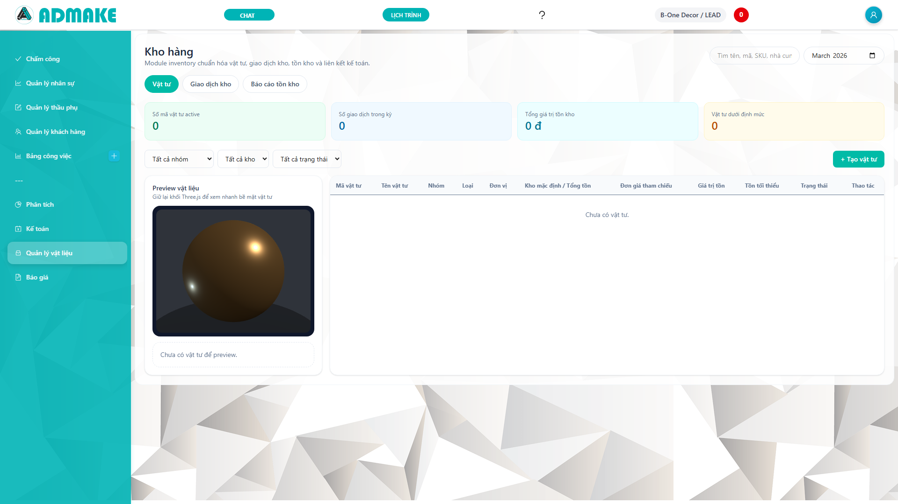
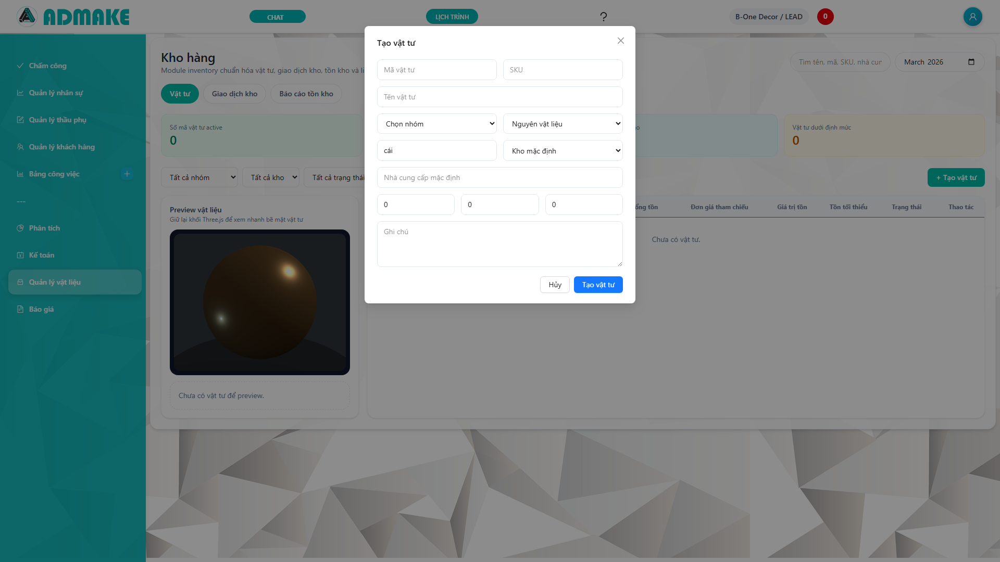
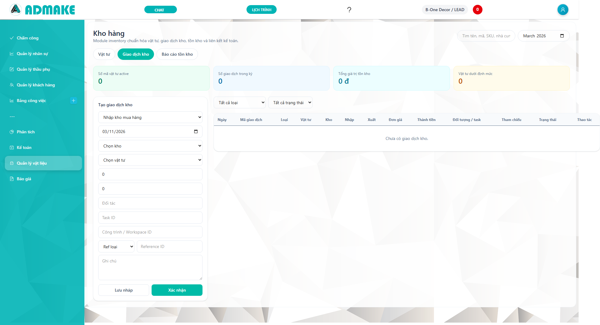
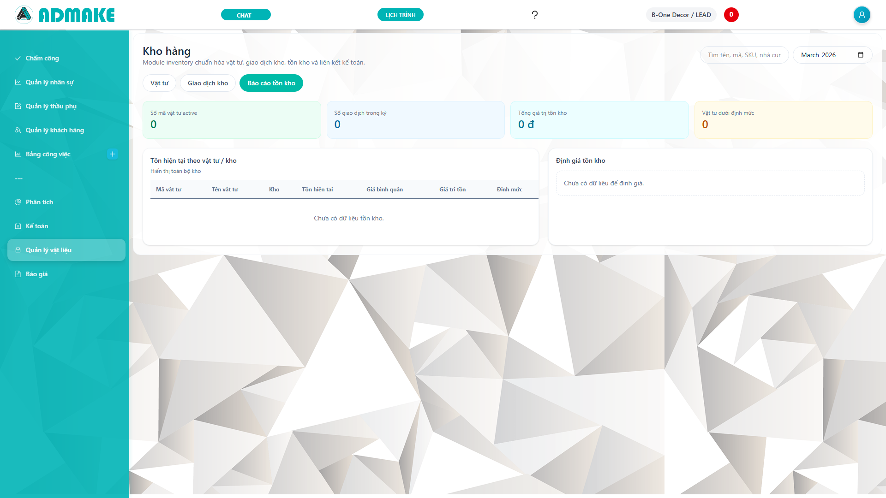

# CẨM NANG VẬN HÀNH MODULE VẬT LIỆU

> Nếu đang quay lại repo để bảo trì code hoặc kiểm tra production, đọc thêm `guidance/returning_guide.md` và `HELP_ACCOUNT_&_MTL.md` trước. File này thiên về hướng dẫn nghiệp vụ cho người dùng vận hành.

Tài liệu này là cẩm nang nội bộ dành cho thủ kho, kế toán kho, bộ phận mua hàng, quản lý sản xuất và điều hành cần sử dụng module Vật liệu trong hệ thống Admake. Mục tiêu của manual là giúp người dùng hiểu đúng master data vật tư, giao dịch kho, tồn kho, giá trị tồn kho và mối liên kết giữa kho với chứng từ và kế toán.

Module Vật liệu hiện được triển khai theo hướng inventory MVP thực dụng. Hệ thống đã có danh mục vật tư, kho, giao dịch kho, số dư tồn theo kho, preview vật liệu bằng Three.js, báo cáo tồn và liên kết traceability về chứng từ, công nợ và bút toán kế toán. Manual này không chỉ mô tả giao diện mà còn đi vào cách vận hành, các tình huống chuẩn, checklist kiểm soát và bộ test case đào tạo.

- Route chính: `/materials`
- Độ phân giải khuyến nghị: `1920x1080`
- Người dùng phù hợp: thủ kho, kế toán kho, mua hàng, quản lý xưởng, quản lý dự án, kế toán tổng hợp
- Nguyên tắc dùng: không sửa tay tồn kho, mọi thay đổi phải đi qua giao dịch kho hoặc bút toán điều chỉnh hợp lệ

---

## 1. Tổng quan module vật liệu

Module Vật liệu là nơi quản lý danh mục vật tư, vị trí lưu trữ, giao dịch nhập xuất và báo cáo tồn. Người dùng cần coi đây là nguồn dữ liệu chính cho phần tồn kho, không được duy trì tồn bằng file Excel song song nếu muốn số liệu kế toán và kho khớp nhau.

Vai trò của module:
- Lưu master data vật tư và nhóm vật tư.
- Quản lý kho chứa hàng và kho mặc định.
- Ghi nhận nhập kho, xuất kho, chuyển kho, điều chỉnh tồn.
- Duy trì số dư tồn theo giao dịch kho.
- Tính giá trị tồn theo giá bình quân động.
- Cung cấp traceability sang chứng từ, công nợ và bút toán.

Tuyến dữ liệu chuẩn:
- Vật tư -> giao dịch kho -> số dư tồn -> báo cáo tồn.
- Giao dịch kho -> liên kết chứng từ hoặc AP/AR -> journal entry.
- Tồn kho cuối kỳ -> đối chiếu với tài khoản hàng tồn kho.

Nguyên tắc sử dụng:
- Không nhập âm số lượng.
- Không sửa trực tiếp giao dịch đã confirmed.
- Không xóa vật tư hoặc kho đã có phát sinh.
- Khi sai nghiệp vụ, dùng cancel hoặc adjustment thay vì sửa tay.
- Luôn kiểm tra kho, vật tư, loại giao dịch và tham chiếu chứng từ trước khi xác nhận.

---

## 2. Giao diện tổng quan và các tab chính

Màn hình Vật liệu hiện có ba khu vực lớn:
- Tab `Vật tư`
- Tab `Giao dịch kho`
- Tab `Báo cáo tồn kho`

Ngoài ra ở tab Vật tư còn có cụm preview vật liệu bằng Three.js để người dùng xem nhanh bề mặt hoặc nhóm vật liệu đang chọn. Khu vực này giữ vai trò trực quan, hỗ trợ nhận diện vật liệu tốt hơn khi quản lý danh mục.

Những thành phần người dùng nên hiểu:
- Summary cards ở đầu màn hình.
- Thanh tìm kiếm.
- Bộ lọc theo nhóm, kho, trạng thái.
- Danh sách vật tư.
- Panel tạo giao dịch kho.
- Bảng nhật ký giao dịch.
- Bảng tồn hiện tại theo vật tư và kho.

Checklist đọc nhanh giao diện:
- Summary card đang phản ánh kỳ nào.
- Bộ lọc tháng và kho có đang đúng không.
- Mình đang đứng ở tab nào.
- Dòng vật tư đang preview là vật tư nào.

---

## 3. Summary cards và cách hiểu đúng số liệu

Summary cards trên màn hình Vật liệu không phải số để sửa mà là số tổng hợp từ dữ liệu giao dịch và số dư tồn. Người dùng cần hiểu rõ ý nghĩa của từng ô để tránh diễn giải sai.

Các chỉ số chính:
- Số mã vật tư active.
- Số giao dịch trong kỳ.
- Tổng giá trị tồn kho.
- Số vật tư dưới định mức.

Ý nghĩa nghiệp vụ:
- `Số mã vật tư active`: chỉ đếm vật tư còn đang sử dụng.
- `Số giao dịch trong kỳ`: phản ánh nhịp phát sinh nhập xuất chứ không phản ánh tồn.
- `Tổng giá trị tồn kho`: dùng để đối chiếu quản trị hoặc kế toán tổng hợp.
- `Số vật tư dưới định mức`: là cảnh báo cho mua hàng và kho.

Sai sót thường gặp khi đọc summary:
- Đọc nhầm số giao dịch thành số lượng hàng.
- Quên đang lọc theo kho nên tưởng tổng toàn công ty.
- Quên đang lọc theo tháng nên summary không khớp lịch sử dài hạn.

Checklist kiểm tra summary:
- Đúng tháng.
- Đúng kho.
- Đúng trạng thái.
- Đúng ý nghĩa chỉ số.

---

## 4. Preview vật liệu bằng Three.js

Preview Three.js là phần trực quan riêng của màn Vật tư. Mục tiêu của nó không phải thay thế thông số kỹ thuật mà là giúp người dùng nhận diện nhanh nhóm vật liệu, màu sắc hoặc cảm giác bề mặt đại diện. Khi chọn một dòng trong bảng vật tư, preview thay đổi tương ứng theo `item_type`.

Giá trị thực tế của preview:
- Hỗ trợ nhận diện nhanh vật tư khi danh mục nhiều.
- Tăng khả năng training cho nhân sự mới.
- Hỗ trợ trình bày nội bộ với quản lý hoặc bộ phận thiết kế.

Cách sử dụng:
- Bấm một dòng vật tư trong bảng.
- Quan sát khối preview bên trái.
- Xem thông tin tóm tắt như mã, SKU, đơn vị, giá bình quân, tồn hiện tại.

Những điều preview không làm:
- Không quyết định giá vốn.
- Không thay thế hình ảnh sản phẩm thực.
- Không phản ánh từng biến thể chi tiết nếu hệ thống chưa lưu thuộc tính bề mặt riêng.

Trường hợp sử dụng:
- Đào tạo thủ kho mới.
- Kiểm tra nhanh danh mục vật tư theo loại.
- Trình bày sơ bộ cho phòng điều hành.

---

## 5. Danh mục vật tư

Danh mục vật tư là trung tâm master data của module. Nếu danh mục được tạo chuẩn, các giao dịch nhập xuất và báo cáo sau này mới đáng tin cậy. Người dùng phải nhập nhất quán mã vật tư, tên vật tư, loại, đơn vị tính, kho mặc định và giá tham chiếu.

Các trường dữ liệu chính:
- Mã vật tư.
- Tên vật tư.
- SKU.
- Nhóm vật tư.
- Loại vật tư.
- Đơn vị tính.
- Kho mặc định.
- Nhà cung cấp mặc định.
- Giá chuẩn.
- Giá bình quân.
- Tồn tối thiểu.
- Trạng thái sử dụng.

Các loại vật tư hiện có:
- Nguyên vật liệu.
- Hàng hóa.
- Bán thành phẩm.
- Thành phẩm.

Nguyên tắc đặt mã:
- Dễ tìm, không quá dài.
- Có logic theo nhóm hoặc theo nhà máy nếu cần.
- Không đổi mã sau khi đã có giao dịch, trừ khi có chính sách đổi mã chuẩn.

---

## 6. Quy trình tạo vật tư mới

Tạo vật tư mới là bước phải làm cẩn thận vì sai từ đây sẽ lặp lại ở mọi giao dịch về sau. Người dùng chỉ nên tạo vật tư khi chắc chắn vật tư đó chưa tồn tại trong hệ thống.

Quy trình chuẩn:
1. Vào tab `Vật tư`.
2. Bấm `+ Tạo vật tư`.
3. Nhập mã vật tư.
4. Nhập tên vật tư.
5. Nhập SKU nếu doanh nghiệp dùng mã nội bộ.
6. Chọn nhóm vật tư.
7. Chọn loại vật tư.
8. Nhập đơn vị tính.
9. Chọn kho mặc định.
10. Nhập nhà cung cấp mặc định.
11. Nhập giá chuẩn, giá bình quân khởi tạo nếu có.
12. Nhập tồn tối thiểu.
13. Ghi chú nếu cần.
14. Lưu.

Điểm kiểm soát:
- Không trùng mã.
- Không trùng SKU nếu SKU là duy nhất.
- Đơn vị tính phải đúng bản chất vật tư.
- Loại vật tư phải đúng để mapping kế toán chính xác.

Tình huống chuẩn:
- Tạo mới “Tôn kẽm 3 dem”.
- Gán vào nhóm nguyên vật liệu.
- Đơn vị tính là tấm.
- Gán kho tổng làm kho mặc định.

---

## 7. Quy trình cập nhật và ngừng sử dụng vật tư

Cập nhật vật tư cho phép sửa thông tin mô tả, giá chuẩn hoặc tồn tối thiểu. Tuy nhiên không phải trường nào cũng nên thay đổi tự do sau khi vật tư đã có giao dịch.

Được phép cập nhật:
- Tên hiển thị.
- Nhà cung cấp mặc định.
- Kho mặc định.
- Giá chuẩn tham khảo.
- Tồn tối thiểu.
- Ghi chú.

Không nên thay đổi tùy tiện:
- Mã vật tư đã dùng.
- Loại vật tư nếu đã có mapping kế toán.
- Đơn vị tính nếu đã có giao dịch theo đơn vị cũ.

Khi vật tư không còn dùng:
- Không xóa nếu đã phát sinh giao dịch.
- Chuyển trạng thái sang `Ngừng dùng`.
- Giữ vật tư cũ để phục vụ báo cáo lịch sử.

Tình huống sử dụng:
- Vật tư đổi nhà cung cấp nhưng vẫn là cùng một item.
- Vật tư cần nâng định mức tồn tối thiểu.
- Vật tư không còn sản xuất hoặc ngừng nhập.

---

## 8. Kho và vai trò của kho mặc định

Kho trong hệ thống là đơn vị lưu trữ phục vụ nhập, xuất và đối chiếu tồn. Dù triển khai MVP tối giản, người dùng vẫn phải chọn đúng kho trong từng giao dịch vì đây là chìa khóa để đọc tồn theo vị trí lưu trữ.

Thông tin kho:
- Mã kho.
- Tên kho.
- Địa điểm.
- Trạng thái.
- Cờ kho mặc định.

Kho mặc định có ý nghĩa:
- Được dùng sẵn khi tạo item hoặc giao dịch.
- Giảm sai sót thao tác.
- Không thay thế cho việc chọn kho đúng ở từng phiếu.

Nguyên tắc:
- Chỉ nên có một hoặc rất ít kho mặc định theo lead.
- Không xóa kho đã có giao dịch.
- Nếu kho ngừng hoạt động, cần khóa trạng thái thay vì xóa.

---

## 9. Giao dịch kho: khái niệm và trạng thái

Giao dịch kho là lớp dữ liệu duy nhất được phép làm thay đổi tồn. Người dùng phải hiểu rõ các loại giao dịch và trạng thái của chúng để không làm sai tồn kho.

Các loại giao dịch hiện có:
- Nhập kho mua hàng.
- Xuất kho bán hàng.
- Xuất dùng nội bộ.
- Xuất cho công trình.
- Nhập trả hàng.
- Điều chỉnh tăng.
- Điều chỉnh giảm.
- Chuyển kho.

Trạng thái:
- Draft.
- Confirmed.
- Cancelled.

Nguyên tắc quan trọng:
- Draft chưa làm thay đổi tồn thật.
- Confirmed là bất biến.
- Sai thì cancel hoặc tạo adjustment, không sửa trực tiếp bản ghi confirmed.

---

## 10. Quy trình nhập kho

Nhập kho thường đi cùng mua hàng, trả hàng hoặc điều chỉnh tăng. Đây là nghiệp vụ làm tăng tồn và có thể làm tăng giá trị tồn kho.

Quy trình chuẩn:
1. Chọn tab `Giao dịch kho`.
2. Chọn loại `Nhập kho mua hàng` hoặc loại nhập phù hợp.
3. Chọn kho nhập.
4. Chọn vật tư.
5. Nhập số lượng.
6. Nhập đơn giá.
7. Chọn đối tác nếu có.
8. Chọn tham chiếu chứng từ nếu có.
9. Lưu nháp hoặc xác nhận.

Điểm kiểm soát:
- Số lượng phải > 0.
- Đơn giá không âm.
- Vật tư phải đang active.
- Kho phải active.
- Chọn đúng nhà cung cấp nếu giao dịch mua hàng.

Tình huống chuẩn:
- Nhập 100 tấm alu vào kho tổng.
- Đơn giá 450.000 một tấm.
- Link với chứng từ mua hoặc bill AP nếu có.

---

## 11. Quy trình xuất kho

Xuất kho là nghiệp vụ làm giảm tồn. Hệ thống đang lấy giá xuất theo average cost hiện tại thay vì cho nhập tay tùy ý ở mọi trường hợp chuẩn. Điều này rất quan trọng vì ảnh hưởng tới giá trị tồn và giá vốn.

Quy trình chuẩn:
1. Chọn loại xuất phù hợp.
2. Chọn kho xuất.
3. Chọn vật tư.
4. Nhập số lượng.
5. Chọn đối tượng hoặc task nếu có.
6. Chọn tham chiếu chứng từ nếu có.
7. Xác nhận.

Điểm kiểm soát:
- Không xuất vượt tồn nếu hệ thống đang chặn âm kho.
- Kiểm tra kho đang có số lượng khả dụng.
- Chọn đúng mục đích xuất: bán hàng, nội bộ, công trình.

Tình huống chuẩn:
- Xuất 20 tấm alu cho công trình showroom.
- Xuất 5 hộp vít cho nội bộ xưởng.

Lỗi thường gặp:
- Chọn sai kho nên tưởng thiếu tồn.
- Nhập sai vật tư có mã gần giống nhau.
- Dùng loại xuất sai dẫn đến mapping kế toán không đúng.

---

## 12. Chuyển kho và điều chỉnh tồn

Chuyển kho là nghiệp vụ chuyển vật tư từ kho nguồn sang kho đích mà không làm thay đổi tổng tồn toàn doanh nghiệp. Điều chỉnh tăng giảm là nghiệp vụ đặc biệt, chỉ nên dùng khi có lý do rõ ràng như kiểm kê chênh lệch, hao hụt, thừa hàng.

Nguyên tắc chuyển kho:
- Phải có kho nguồn và kho đích khác nhau.
- Phải đủ tồn ở kho nguồn nếu chặn âm kho.
- Giá trị vật tư được chuyển theo cost basis hiện tại.

Nguyên tắc điều chỉnh:
- Chỉ dùng khi có lý do.
- Cần ghi chú rõ nguyên nhân.
- Nên được kiểm soát quyền.

Tình huống chuẩn:
- Chuyển 30 tấm mica từ kho tổng sang kho công trình.
- Điều chỉnh giảm 2 tấm do hư hỏng.
- Điều chỉnh tăng 5 bộ phụ kiện do kiểm kê phát hiện thừa.

---

## 13. Nhật ký giao dịch kho

Nhật ký giao dịch kho là bảng lịch sử phát sinh nhập xuất. Đây là nơi thủ kho và kế toán kho kiểm tra ai đã tạo giao dịch gì, ngày nào, thuộc loại nào, đã xác nhận hay chưa.

Thông tin thường đọc:
- Ngày giao dịch.
- Mã giao dịch.
- Loại giao dịch.
- Vật tư.
- Kho.
- Số lượng nhập hoặc xuất.
- Đơn giá.
- Thành tiền.
- Đối tượng hoặc task.
- Tham chiếu.
- Trạng thái.

Giá trị sử dụng:
- Rà giao dịch trong ngày.
- Tìm lý do tồn biến động.
- Mở chi tiết một giao dịch để xem traceability.

---

## 14. Chi tiết giao dịch kho và traceability

Màn hình chi tiết giao dịch là nơi người dùng xem sâu một transaction đã tạo. Đây là điểm quan trọng khi cần truy nguồn gốc hoặc giải thích vì sao tồn và kế toán biến động.

Thông tin cần xem:
- Mã giao dịch.
- Trạng thái.
- Ngày giao dịch.
- Loại.
- Vật tư.
- Kho nguồn và kho đích nếu có.
- Số lượng.
- Giá trị.
- Đối tác, task hoặc công trình.
- Tham chiếu chứng từ.
- Ghi chú.
- Liên kết kế toán hoặc chứng từ.

Các trường hợp nên mở chi tiết:
- Khi summary thay đổi bất thường.
- Khi báo cáo tồn không khớp kỳ vọng.
- Khi kế toán hỏi nguồn gốc của một bút toán hàng tồn kho.
- Khi cần kiểm tra payment hoặc AP/AR liên quan.

Traceability mong muốn:
- Từ giao dịch kho sang journal.
- Từ giao dịch kho sang document.
- Từ giao dịch kho sang AP/AR nếu có tham chiếu.

---

## 15. Báo cáo tồn kho

Tab Báo cáo tồn kho là nơi xem số lượng tồn hiện tại, giá bình quân, giá trị tồn và mức tồn tối thiểu theo từng vật tư và từng kho. Đây là màn hình rất hữu ích cho thủ kho, mua hàng và kế toán tổng hợp.

- Route thao tác: `/materials` với tab `Báo cáo tồn kho`
- Ảnh minh họa: `screenshots/materials/reports.png`

Mục đích sử dụng:
- Xem tồn hiện tại.
- Xem giá trị tồn.
- Xem vật tư dưới định mức.
- Phục vụ kế hoạch nhập hàng.
- Phục vụ đối chiếu với kế toán.

Điểm kiểm soát:
- Đọc theo đúng kho nếu đang cần đối chiếu kho cụ thể.
- Không dùng số liệu này nếu giao dịch còn nháp chưa xác nhận mà nghiệp vụ thực tế đã diễn ra.
- Kiểm tra giá bình quân nếu thấy giá trị tồn bất thường.

---

## 16. Giá bình quân động và giá trị tồn kho

Hệ thống hiện dùng moving average cost cho MVP. Điều đó nghĩa là mỗi lần nhập kho, giá bình quân của vật tư trong kho được tính lại dựa trên tổng lượng và tổng giá trị mới. Mỗi lần xuất kho, hệ thống dùng giá bình quân hiện tại để xác định giá trị xuất.

Ý nghĩa với người dùng:
- Không nên mong chờ mọi lần xuất đều dùng giá tay.
- Nếu giá trị tồn sai, phải kiểm tra các giao dịch nhập gần nhất.
- Khi nhập sai đơn giá, hậu quả sẽ lan sang giá trị tồn và các giao dịch xuất sau đó.

Ví dụ đơn giản:
- Tồn đầu: 10 đơn vị, giá trị 1.000.000.
- Nhập thêm: 5 đơn vị, giá trị 750.000.
- Tồn mới: 15 đơn vị, giá trị 1.750.000.
- Giá bình quân mới: 116.666,67 mỗi đơn vị.

Điểm kiểm soát:
- Đơn giá nhập phải đúng.
- Không tạo giao dịch nhập giả để “sửa tồn”.
- Khi điều chỉnh, phải hiểu nó ảnh hưởng giá bình quân thế nào.

---

## 17. Liên kết với kế toán

Module vật liệu không đứng riêng mà đã được nối với kế toán. Khi confirmed transaction, hệ thống có thể sinh journal entry tương ứng theo mapping của loại vật tư hoặc loại giao dịch.

Các nguyên tắc mapping hiện tại:
- Nhập kho mua hàng: Nợ tài khoản tồn kho, Có 331 hoặc tài khoản đối ứng.
- Xuất bán: Nợ 632, Có tài khoản tồn kho.
- Xuất dùng nội bộ hoặc công trình: Nợ chi phí hoặc WIP, Có tài khoản tồn kho.
- Điều chỉnh tăng: Nợ tồn kho, Có tài khoản điều chỉnh tăng.
- Điều chỉnh giảm: Nợ tài khoản điều chỉnh giảm, Có tồn kho.

Người dùng cần nhớ:
- Không phải mọi giao dịch kho đều kéo theo thanh toán tiền ngay.
- Có giao dịch chỉ làm biến động tồn và bút toán, chưa chắc đã liên quan thu chi.
- Nếu giao dịch có reference tới AP hoặc document, traceability phải có thể kiểm lại.

---

## 18. Liên kết với chứng từ và công nợ

Một giao dịch kho chuẩn nên có thể gắn với:
- Chứng từ mua hàng.
- Bill AP.
- Invoice AR hoặc sales document mềm.
- Task hoặc công trình.
- Manual reference nếu chưa có module nguồn đầy đủ.

Lợi ích:
- Tìm nhanh lý do nhập xuất.
- Giải trình được khi audit.
- Giảm nhập trùng dữ liệu.

Tình huống thực tế:
- Phiếu nhập kho gắn bill mua hàng.
- Phiếu xuất cho công trình gắn task.
- Điều chỉnh tồn gắn biên bản kiểm kê.

---

## 19. Quy trình mua hàng nhập kho

Đây là kịch bản chuẩn nhất để đào tạo kết nối giữa kho, mua hàng và kế toán.

Tình huống giả định:
- Mua 500 tấm alu từ NCC Minh Quân.
- Đơn giá 320.000.
- Chưa thanh toán ngay.

Quy trình:
1. Tạo giao dịch nhập kho.
2. Chọn vật tư, kho, số lượng, đơn giá, nhà cung cấp.
3. Xác nhận giao dịch.
4. Kiểm tra số dư tồn tăng.
5. Tạo AP bill hoặc kiểm tra AP đã liên kết.
6. Kiểm tra journal nếu auto-accounting đang bật.

Kỳ vọng:
- Tồn kho tăng 500.
- Giá trị tồn tăng đúng.
- Traceability có link tới chứng từ hoặc AP.

---

## 20. Quy trình xuất kho cho công trình

Xuất kho cho công trình là nghiệp vụ phổ biến trong doanh nghiệp thi công hoặc sản xuất theo dự án.

Tình huống giả định:
- Xuất 120 tấm alu cho công trình showroom Mica.
- Gắn workspace hoặc task liên quan.

Quy trình:
1. Chọn loại `Xuất cho công trình`.
2. Chọn kho xuất.
3. Chọn vật tư và số lượng.
4. Gắn task hoặc workspace.
5. Xác nhận.

Kỳ vọng:
- Tồn kho giảm.
- Giá trị xuất dùng theo average cost.
- Có thể truy ra task hoặc project khi cần đối chiếu chi phí.

---

## 21. Quy trình xuất dùng nội bộ

Xuất dùng nội bộ áp dụng cho vật tư tiêu hao, vật liệu dùng cho xưởng, cho văn phòng hoặc cho bộ phận không tạo thành hàng bán ngay.

Điểm khác với xuất cho công trình:
- Không nhất thiết gắn task.
- Thường đi vào chi phí nội bộ hoặc chi phí sản xuất chung.

Tình huống chuẩn:
- Xuất giấy nhám, băng keo, vít, phụ kiện cho xưởng.

Điểm kiểm soát:
- Chọn đúng loại giao dịch.
- Không nhập nhầm thành xuất bán.

---

## 22. Quy trình chuyển kho

Chuyển kho giúp tái phân bổ vật tư giữa các địa điểm. Người dùng phải kiểm tra cả kho nguồn lẫn kho đích.

Checklist:
- Kho nguồn đủ tồn.
- Kho đích đúng nơi nhận.
- Vật tư đúng mã.
- Số lượng đúng.

Sai sót hay gặp:
- Chọn nhầm kho đích.
- Chọn cùng một kho cho cả nguồn và đích.

---

## 23. Quy trình điều chỉnh tồn kho

Điều chỉnh tồn chỉ dùng khi có biên bản hoặc lý do rõ ràng. Không dùng điều chỉnh để thay cho nhập xuất bình thường.

Các trường hợp hợp lệ:
- Kiểm kê thừa.
- Kiểm kê thiếu.
- Hư hỏng, mất mát.
- Lỗi ghi nhận trước đó cần bút toán điều chỉnh.

Điểm kiểm soát:
- Có lý do.
- Có ghi chú.
- Có phê duyệt nếu quy trình nội bộ yêu cầu.

---

## 24. Vật tư dưới định mức và kế hoạch mua hàng

Summary card và báo cáo tồn cho phép phát hiện vật tư dưới định mức. Đây là chức năng quan trọng cho bộ phận mua hàng và quản lý kho.

Quy trình sử dụng:
- Lọc báo cáo tồn.
- Xem các vật tư có `below_min_stock`.
- So với kế hoạch thi công hoặc sản xuất.
- Tạo danh sách đề xuất mua.

Lợi ích:
- Giảm thiếu hàng đột xuất.
- Hạn chế dừng công việc vì thiếu vật tư.

---

## 25. Bộ test case cho danh mục vật tư

Test case 1:
- Tạo vật tư mới.
- Kiểm tra hiển thị trong danh sách.
- Kiểm tra tồn ban đầu bằng 0.

Test case 2:
- Sửa giá chuẩn.
- Kiểm tra danh sách cập nhật.

Test case 3:
- Ngừng sử dụng vật tư.
- Kiểm tra badge trạng thái.

Test case 4:
- Thử xóa vật tư đã có giao dịch.
- Kỳ vọng: hệ thống chặn.

---

## 26. Bộ test case cho giao dịch kho

Test case 1:
- Tạo draft giao dịch nhập.
- Kiểm tra tồn chưa đổi.

Test case 2:
- Confirm giao dịch nhập.
- Kiểm tra tồn tăng.

Test case 3:
- Tạo giao dịch xuất vượt tồn.
- Kỳ vọng: hệ thống chặn nếu không cho âm kho.

Test case 4:
- Cancel giao dịch confirmed.
- Kỳ vọng: tồn được đảo về đúng trạng thái trước đó theo logic hệ thống.

---

## 27. Bộ test case cho báo cáo tồn

Test case 1:
- Nhập kho 100 đơn vị.
- Xuất kho 20 đơn vị.
- Kỳ vọng: tồn còn 80.

Test case 2:
- Lọc theo kho.
- Kỳ vọng: số liệu chỉ phản ánh kho đã chọn.

Test case 3:
- So báo cáo tồn với inventory balances.
- Kỳ vọng: giá trị tồn và số lượng khớp.

---

## 28. Bộ test case cho liên kết kế toán

Test case 1:
- Confirm nhập kho mua hàng.
- Kỳ vọng: có accounting entry hoặc trace link tương ứng.

Test case 2:
- Confirm xuất kho.
- Kỳ vọng: giao dịch có thể truy ra journal hoặc nguồn phát sinh.

Test case 3:
- Mở chi tiết transaction.
- Kỳ vọng: thấy trace links liên quan.

---

## 29. Checklist đầu ngày cho thủ kho

- Kiểm tra giao dịch nháp từ hôm trước.
- Kiểm tra vật tư dưới định mức.
- Kiểm tra kho nào chuẩn bị xuất nhiều trong ngày.
- Kiểm tra có giao dịch pending cần xác nhận không.

---

## 30. Checklist cuối ngày cho thủ kho

- Đối chiếu giao dịch nhập xuất trong ngày.
- Kiểm tra giao dịch đã confirmed hay chưa.
- Kiểm tra item nào vừa rơi xuống dưới định mức.
- Báo kế toán nếu có điều chỉnh tồn bất thường.

---

## 31. Checklist cho kế toán kho

- Kiểm tra giá trị tồn biến động lớn.
- Kiểm tra giao dịch có reference nhưng thiếu trace.
- Kiểm tra xuất kho có đi đúng cost basis.
- Kiểm tra đối chiếu tồn kho với tài khoản tồn kho cuối kỳ.

---

## 32. Checklist cho bộ phận mua hàng

- Xem vật tư dưới định mức.
- Xem vật tư có tần suất xuất cao.
- Xem nhà cung cấp mặc định của từng vật tư quan trọng.
- Lập kế hoạch mua dựa trên tồn thực.

---

## 33. Checklist cho quản lý sản xuất hoặc công trình

- Kiểm tra vật tư sẵn có trước khi giao việc.
- Kiểm tra xuất kho cho task hoặc workspace.
- Kiểm tra vật tư tiêu hao bất thường.
- Kiểm tra vật tư bị điều chỉnh nhiều lần.

---

## 34. FAQ cho người dùng mới

Câu hỏi 1: Vì sao tạo giao dịch rồi mà tồn chưa đổi.
- Vì giao dịch đang ở trạng thái draft.

Câu hỏi 2: Vì sao xuất kho bị chặn.
- Có thể không đủ tồn hoặc chọn sai kho.

Câu hỏi 3: Vì sao giá trị xuất không đúng đơn giá tôi nhập.
- Vì hệ thống dùng average cost cho nghiệp vụ xuất chuẩn.

Câu hỏi 4: Có được xóa giao dịch confirmed không.
- Không. Phải cancel hoặc adjustment theo quy trình.

Câu hỏi 5: Vì sao báo cáo tồn khác Excel nội bộ.
- Có thể Excel không cập nhật đủ hoặc hệ thống đang lọc theo kho/tháng khác.

---

## 35. Mẫu xử lý khi tồn kho lệch thực tế

Quy trình nên làm:
1. Kiểm tra giao dịch nháp.
2. Kiểm tra giao dịch bị nhập sai kho.
3. Kiểm tra giao dịch cancel hoặc reversal.
4. Kiểm kê thực tế.
5. Nếu cần, lập giao dịch điều chỉnh có căn cứ.

Điều không nên làm:
- Không sửa trực tiếp số tồn.
- Không nhập giao dịch giả để bù số mà không có giải thích.

---

## 36. Mẫu xử lý khi giá trị tồn bất thường

Các bước:
- Xem nhập gần nhất của vật tư.
- Kiểm tra đơn giá nhập có nhầm không.
- Kiểm tra có adjustment lớn không.
- Kiểm tra average cost trước và sau giao dịch.

---

## 37. Mẫu xử lý khi kho báo thiếu hàng

Các bước:
- Xác định kho nào thiếu.
- Kiểm tra giao dịch xuất gần nhất.
- Kiểm tra có giao dịch chuyển kho treo không.
- Kiểm tra vật tư có đang ở kho khác không.
- Quyết định nhập bù, chuyển kho hoặc điều chỉnh.

---

## 38. Mẫu xử lý khi cần truy giao dịch về chứng từ gốc

Các bước:
- Mở chi tiết transaction.
- Xem reference type và reference id.
- Xem trace links.
- Mở chứng từ hoặc AP/AR liên quan.
- Đối chiếu số tiền và ngày phát sinh.

---

## 39. Kịch bản phối hợp với AP

Kịch bản:
- Mua vật tư.
- Nhập kho.
- Tạo bill AP.
- Thanh toán bill.

Mục tiêu:
- Tồn kho tăng đúng.
- Công nợ phải trả tăng rồi giảm đúng.
- Traceability liền mạch.

---

## 40. Kịch bản phối hợp với AR hoặc sales

Kịch bản:
- Xuất hàng cho khách.
- Gắn reference bán hàng.
- Thu tiền theo tiến độ nếu có.

Mục tiêu:
- Tồn kho giảm.
- Giá vốn phản ánh đúng.
- Có thể đối chiếu doanh thu và hàng xuất.

---

## 41. Kịch bản phối hợp với công trình

Kịch bản:
- Xuất vật tư cho task hoặc project.
- Theo dõi lượng xuất theo công trình.
- Đối chiếu với chi phí công trình.

Mục tiêu:
- Biết công trình nào tiêu hao vật tư nhiều.
- Truy được vật tư đã cấp phát.

---

## 42. Kịch bản kiểm kê cuối tháng

Quy trình:
- Chốt danh sách giao dịch.
- In hoặc xuất báo cáo tồn.
- Kiểm kê thực tế.
- Ghi nhận chênh lệch.
- Lập adjustment nếu cần.

Điểm kiểm soát:
- Không kiểm kê khi còn nhiều giao dịch nháp.
- Không điều chỉnh nếu chưa có xác nhận chênh lệch.

---

## 43. Kịch bản bàn giao cho nhân sự kho mới

Ngày 1:
- Học danh mục vật tư và cách tìm kiếm.

Ngày 2:
- Học tạo giao dịch nhập xuất và đọc tồn.

Ngày 3:
- Học báo cáo tồn, xử lý sai lệch và phối hợp với kế toán.

Người hướng dẫn cần:
- Giao case nhập kho.
- Giao case xuất kho.
- Giao case dò lệch tồn.

---

## 44. Checklist chốt tháng cho kho

- Không còn giao dịch nháp treo.
- Đã kiểm tra vật tư dưới định mức.
- Đã rà điều chỉnh tăng giảm.
- Đã đối chiếu báo cáo tồn.
- Đã ghi nhận các chênh lệch cần giải thích.

---

## 45. Checklist đối chiếu kho với kế toán

- Tổng giá trị tồn kho.
- Danh sách giao dịch phát sinh lớn.
- Giao dịch có journal link.
- Chứng từ nhập kho lớn.
- Xuất cho công trình lớn.

---

## 46. Quy ước dữ liệu nên áp dụng

- Mã vật tư thống nhất.
- Tên vật tư không viết quá mơ hồ.
- Đơn vị tính nhất quán.
- Ghi chú rõ lý do adjustment.
- Reference luôn nhập nếu có chứng từ gốc.

---

## 47. Những sai lầm phổ biến cần tránh

- Tạo trùng vật tư vì không tìm trước.
- Nhập sai kho.
- Confirm khi chưa kiểm tra số lượng.
- Dùng adjustment quá thường xuyên.
- Không gắn task hoặc chứng từ khi nghiệp vụ có nguồn rõ ràng.

---

## 48. Bộ câu hỏi kiểm tra sau đào tạo

- Làm sao biết một giao dịch đã tác động tồn thật hay chưa.
- Khi nào được ngừng dùng vật tư thay vì xóa.
- Tại sao xuất kho không dùng đơn giá tay.
- Tại sao phải gắn reference cho giao dịch.
- Cách truy từ transaction sang journal.

---

## 49. Kết luận vận hành module vật liệu

Điểm mạnh của module Vật liệu nằm ở chỗ mọi thay đổi tồn kho đều đi qua giao dịch rõ ràng và có thể đối chiếu về sau. Khi người dùng tuân thủ nguyên tắc nhập đúng vật tư, đúng kho, đúng loại giao dịch và đúng tham chiếu, hệ thống sẽ giữ được tồn kho đáng tin cậy và hỗ trợ kế toán rất tốt.

Ba điều cần nhớ:
- Tồn kho phải đi từ giao dịch.
- Giá trị tồn phải đi từ cost basis rõ ràng.
- Sai thì phải cancel hoặc adjustment, không sửa tay.

---

## 50. Phụ lục ảnh minh họa

Danh sách ảnh dùng trong manual:
- `screenshots/materials/overview.png`
- `screenshots/materials/items.png`
- `screenshots/materials/create-item.png`
- `screenshots/materials/transactions.png`
- `screenshots/materials/reports.png`

Manual này nên được cập nhật mỗi khi giao diện kho thay đổi hoặc khi bổ sung thêm loại giao dịch, báo cáo hoặc liên kết kế toán mới.
